<!--
author:   CK12 Editor

email:    LiaScript@web.de

version:  0.0.1

language: en

narrator: US English Female

comment:  Nanoleap by MCREL

logo:     ../cover.jpg

tags:      science, technology, nanotechnology

-->

# Nanoleap Student Journal

> This document was automatically translated to LiaScript from
>
> https://www.ck12.org/book/nanoleap-student-journal/

## 1.0 How Can a Gecko Walk on a Ceiling?

<article>

\_\_\_\_\_\_\_\_\_\_\_\_\_\_\_\_\_\_\_\_\_\_\_\_\_\_\_\_\_\_\_\_\_\_\_\_\_\_\_\_\_\_\_\_\_\_\_\_\_\_\_\_\_\_\_\_\_\_\_\_\_\_

\_\_\_\_\_\_\_\_\_\_\_\_\_\_\_\_\_\_\_\_\_\_\_\_\_\_\_\_\_\_\_\_\_\_\_\_\_\_\_\_\_\_\_\_\_\_\_\_\_\_\_\_\_\_\_\_\_\_\_\_\_\_

\_\_\_\_\_\_\_\_\_\_\_\_\_\_\_\_\_\_\_\_\_\_\_\_\_\_\_\_\_\_\_\_\_\_\_\_\_\_\_\_\_\_\_\_\_\_\_\_\_\_\_\_\_\_\_\_\_\_\_\_\_\_

\_\_\_\_\_\_\_\_\_\_\_\_\_\_\_\_\_\_\_\_\_\_\_\_\_\_\_\_\_\_\_\_\_\_\_\_\_\_\_\_\_\_\_\_\_\_\_\_\_\_\_\_\_\_\_\_\_\_\_\_\_\_

**Slide 2**

| Observations | Interpretations |
| --- | --- |

, interpretations (I), or questions (Q).")

\_\_\_\_\_ The frog is green. \_\_\_\_\_ Why is the frog on the person’s arm?

\_\_\_\_\_ The frog is ready to jump. \_\_\_\_\_ The frog is slimy.

\_\_\_\_\_ The frog has $2$ eyes. \_\_\_\_\_ The frog is hungry.

**Title:** **Observations and Interpretations of a Gecko**

**Date:** \_\_\_\_\_\_\_\_\_\_\_\_\_\_\_\_\_\_\_\_\_\_\_\_\_\_\_

(**Write or make labels on the picture if necessary**)

**Slides 3–4**

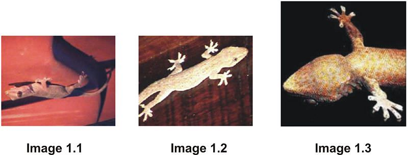
| --- | --- |

**Slides 5–7**

1. What do the images have in common?

\_\_\_\_\_\_\_\_\_\_\_\_\_\_\_\_\_\_\_\_\_\_\_\_\_\_\_\_\_\_\_\_\_\_\_\_\_\_\_\_\_\_\_\_\_\_\_\_\_\_\_\_\_\_\_\_\_\_\_\_\_\_

\_\_\_\_\_\_\_\_\_\_\_\_\_\_\_\_\_\_\_\_\_\_\_\_\_\_\_\_\_\_\_\_\_\_\_\_\_\_\_\_\_\_\_\_\_\_\_\_\_\_\_\_\_\_\_\_\_\_\_\_\_\_

2. _What do you observe about the surfaces and textures in these images?_

\_\_\_\_\_\_\_\_\_\_\_\_\_\_\_\_\_\_\_\_\_\_\_\_\_\_\_\_\_\_\_\_\_\_\_\_\_\_\_\_\_\_\_\_\_\_\_\_\_\_\_\_\_\_\_\_\_\_\_\_\_\_

\_\_\_\_\_\_\_\_\_\_\_\_\_\_\_\_\_\_\_\_\_\_\_\_\_\_\_\_\_\_\_\_\_\_\_\_\_\_\_\_\_\_\_\_\_\_\_\_\_\_\_\_\_\_\_\_\_\_\_\_\_\_

3. _What do you interpret about how the gecko’s foot interacts with the surface?_

\_\_\_\_\_\_\_\_\_\_\_\_\_\_\_\_\_\_\_\_\_\_\_\_\_\_\_\_\_\_\_\_\_\_\_\_\_\_\_\_\_\_\_\_\_\_\_\_\_\_\_\_\_\_\_\_\_\_\_\_\_\_

\_\_\_\_\_\_\_\_\_\_\_\_\_\_\_\_\_\_\_\_\_\_\_\_\_\_\_\_\_\_\_\_\_\_\_\_\_\_\_\_\_\_\_\_\_\_\_\_\_\_\_\_\_\_\_\_\_\_\_\_\_\_

4. What questions do you have or additional information do you need to know in order to understand what makes a gecko adhere to surfaces?

\_\_\_\_\_\_\_\_\_\_\_\_\_\_\_\_\_\_\_\_\_\_\_\_\_\_\_\_\_\_\_\_\_\_\_\_\_\_\_\_\_\_\_\_\_\_\_\_\_\_\_\_\_\_\_\_\_\_\_\_\_\_

\_\_\_\_\_\_\_\_\_\_\_\_\_\_\_\_\_\_\_\_\_\_\_\_\_\_\_\_\_\_\_\_\_\_\_\_\_\_\_\_\_\_\_\_\_\_\_\_\_\_\_\_\_\_\_\_\_\_\_\_\_\_

5. _What are some possible methods for the gecko to adhere to a surface?_

\_\_\_\_\_\_\_\_\_\_\_\_\_\_\_\_\_\_\_\_\_\_\_\_\_\_\_\_\_\_\_\_\_\_\_\_\_\_\_\_\_\_\_\_\_\_\_\_\_\_\_\_\_\_\_\_\_\_\_\_\_\_

\_\_\_\_\_\_\_\_\_\_\_\_\_\_\_\_\_\_\_\_\_\_\_\_\_\_\_\_\_\_\_\_\_\_\_\_\_\_\_\_\_\_\_\_\_\_\_\_\_\_\_\_\_\_\_\_\_\_\_\_\_\_

6. _Describe how you made your observations in today’s lesson:_

a. What tools did you use? \_\_\_\_\_\_\_\_\_\_\_\_\_\_\_\_\_\_\_\_\_\_\_\_\_\_\_

b. Were your observations at the visible or invisible scale? \_\_\_\_\_\_\_\_\_\_\_\_\_\_\_\_

c. What is the dominant force at this scale? \_\_\_\_\_\_\_\_\_\_\_\_\_\_\_\_\_\_\_\_\_\_\_\_

7. What variables affect the force between the animal and the surface?

\_\_\_\_\_\_\_\_\_\_\_\_\_\_\_\_\_\_\_\_\_\_\_\_\_\_\_\_\_\_\_\_\_\_\_\_\_\_\_\_\_\_\_\_\_\_\_\_\_\_\_\_\_\_\_\_\_\_\_\_\_\_

\_\_\_\_\_\_\_\_\_\_\_\_\_\_\_\_\_\_\_\_\_\_\_\_\_\_\_\_\_\_\_\_\_\_\_\_\_\_\_\_\_\_\_\_\_\_\_\_\_\_\_\_\_\_\_\_\_\_\_\_\_\_

_Investigating Static Forces in Nature: The Mystery of the Gecko_

Lesson 1: How Can a Gecko Walk on a Ceiling?

Student Journal

© 2009 McREL

</article>

## 2.0 What Do We Mean When We Speak About Surfaces in Contact?

<article>

</article>

### 2.1 Investigating Static Forces in Nature: The Mystery of the Gecko

<article>

**Activity: Sole Impression**

**Slide 2**

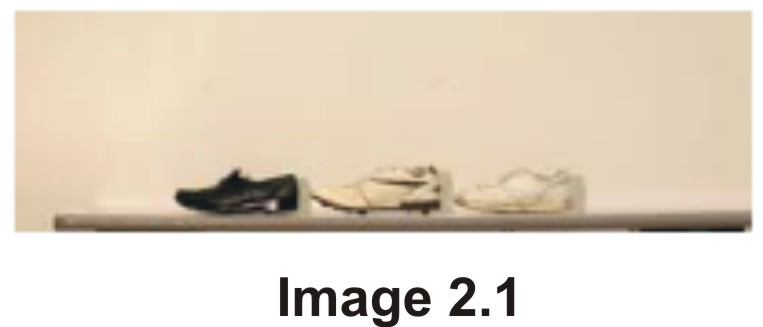

**Shoe on left:**

Most Contact Some Contact Least Contact

**Shoe in middle:**

Most Contact Some Contact Least Contact

**Shoe on right:**

Most Contact Some Contact Least Contact

Why was this exercise difficult?

\_\_\_\_\_\_\_\_\_\_\_\_\_\_\_\_\_\_\_\_\_\_\_\_\_\_\_\_\_\_\_\_\_\_\_\_\_\_\_\_\_\_\_\_\_\_\_\_\_\_\_\_\_\_\_\_\_\_\_\_\_\_

\_\_\_\_\_\_\_\_\_\_\_\_\_\_\_\_\_\_\_\_\_\_\_\_\_\_\_\_\_\_\_\_\_\_\_\_\_\_\_\_\_\_\_\_\_\_\_\_\_\_\_\_\_\_\_\_\_\_\_\_\_\_

What could be done to see more detail and improve your responses?

\_\_\_\_\_\_\_\_\_\_\_\_\_\_\_\_\_\_\_\_\_\_\_\_\_\_\_\_\_\_\_\_\_\_\_\_\_\_\_\_\_\_\_\_\_\_\_\_\_\_\_\_\_\_\_\_\_\_\_\_\_\_

\_\_\_\_\_\_\_\_\_\_\_\_\_\_\_\_\_\_\_\_\_\_\_\_\_\_\_\_\_\_\_\_\_\_\_\_\_\_\_\_\_\_\_\_\_\_\_\_\_\_\_\_\_\_\_\_\_\_\_\_\_\_

**Slide 3**

**Here are the same shoes, only closer up. Based on this close up view, circle one answer and provide a reason for your answer. Label the contact points on the image.**

**Shoe on left:**

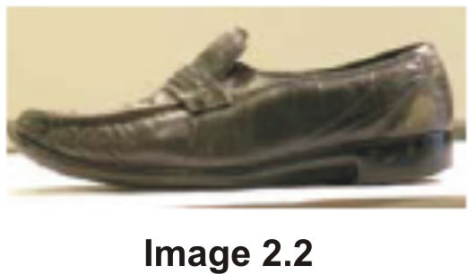

Did your response change from image 2.1? Why or why not?

\_\_\_\_\_\_\_\_\_\_\_\_\_\_\_\_\_\_\_\_\_\_\_\_\_\_\_\_\_\_\_\_\_\_\_\_\_\_\_\_\_\_\_\_\_\_\_\_\_\_\_\_\_\_\_\_\_\_\_\_\_\_

\_\_\_\_\_\_\_\_\_\_\_\_\_\_\_\_\_\_\_\_\_\_\_\_\_\_\_\_\_\_\_\_\_\_\_\_\_\_\_\_\_\_\_\_\_\_\_\_\_\_\_\_\_\_\_\_\_\_\_\_\_\_

**Shoe in middle:**

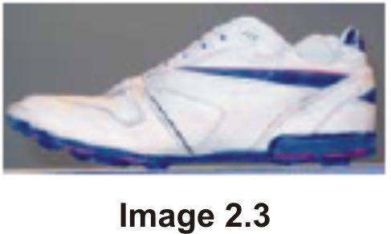

Did your response change from image 2.1? Why or why not?

\_\_\_\_\_\_\_\_\_\_\_\_\_\_\_\_\_\_\_\_\_\_\_\_\_\_\_\_\_\_\_\_\_\_\_\_\_\_\_\_\_\_\_\_\_\_\_\_\_\_\_\_\_\_\_\_\_\_\_\_\_\_

\_\_\_\_\_\_\_\_\_\_\_\_\_\_\_\_\_\_\_\_\_\_\_\_\_\_\_\_\_\_\_\_\_\_\_\_\_\_\_\_\_\_\_\_\_\_\_\_\_\_\_\_\_\_\_\_\_\_\_\_\_\_

**Shoe on right:**

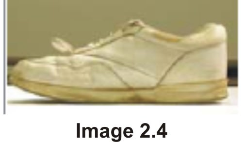

Did your response change from image 2.1? Why or why not?

\_\_\_\_\_\_\_\_\_\_\_\_\_\_\_\_\_\_\_\_\_\_\_\_\_\_\_\_\_\_\_\_\_\_\_\_\_\_\_\_\_\_\_\_\_\_\_\_\_\_\_\_\_\_\_\_\_\_\_\_\_\_

\_\_\_\_\_\_\_\_\_\_\_\_\_\_\_\_\_\_\_\_\_\_\_\_\_\_\_\_\_\_\_\_\_\_\_\_\_\_\_\_\_\_\_\_\_\_\_\_\_\_\_\_\_\_\_\_\_\_\_\_\_\_

**Slide 4**

**Looking at the sole of the shoe, rank the amount of contact. Label the contact points on the image.**

**Shoe on left:**

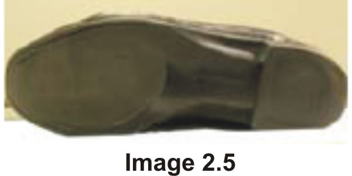

Because:

\_\_\_\_\_\_\_\_\_\_\_\_\_\_\_\_\_\_\_\_\_\_\_\_\_\_\_\_\_\_\_\_\_\_\_\_\_\_\_\_\_\_\_\_\_\_\_\_\_\_\_\_\_\_\_\_\_\_\_\_\_\_

**Shoe in middle:**

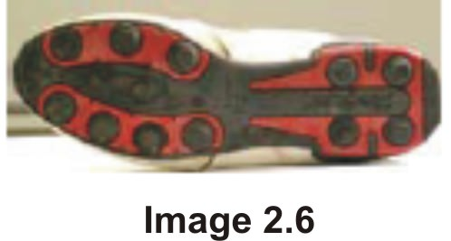

Because:

\_\_\_\_\_\_\_\_\_\_\_\_\_\_\_\_\_\_\_\_\_\_\_\_\_\_\_\_\_\_\_\_\_\_\_\_\_\_\_\_\_\_\_\_\_\_\_\_\_\_\_\_\_\_\_\_\_\_\_\_\_\_

**Shoe on right:**

Because:

\_\_\_\_\_\_\_\_\_\_\_\_\_\_\_\_\_\_\_\_\_\_\_\_\_\_\_\_\_\_\_\_\_\_\_\_\_\_\_\_\_\_\_\_\_\_\_\_\_\_\_\_\_\_\_\_\_\_\_\_\_\_

**Sole Impression**

**Slide 5**

**Determine the ratio of the contact area of your shoe to the total area. Use the following materials/procedure.**

**Materials:**

* One shoe per group that you do not mind getting dirty
* Tray with finely ground sidewalk chalk, charcoal, or tempera paint with rollers (use a color other than white)
* Graph paper

**Procedure:**

1. Depending on the supplies provided by your teacher, cover the bottom of the shoe with ground up chalk, charcoal, or tempera paint. Make sure that the entire sole of the shoe is covered with the substance.

2. Make an impression with the shoe onto graph paper by pressing the shoe firmly onto the paper.

3. Use the counting-squares method for determining the areas. First, count the total number of squares enclosed by the perimeter of the sole of the shoe. Second, count the number of squares that have sidewalk chalk on it. $^{**}$ **If half or more of the square is covered with chalk, count the square.**$^{**}$

4. Determine the ratio by dividing the amount of the surface covered with chalk (contact area) with the total area of the sole of the shoe. Use the space below for your calculations. Make sure you include units of measure with your calculations.

**Results:**

Set up your ratio:

Contact Area

Total Surface Area

**Collect data for five other groups and use this space to complete a data table comparing the ratios of contact area to total area of various shoes in your class:**

| Student/Group (Name) | Shoe Type (tennis shoe, etc.) | Ratio |
| --- | --- | --- |

**Graph Your Comparisons (Ratio of contact to total area vs. Shoe Type)** Be sure to label your graph properly.

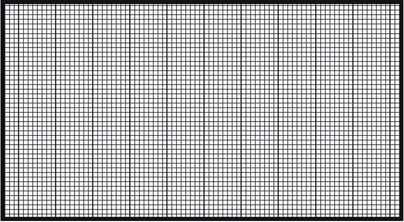

1a. Describe the surface of the shoe.

2. Which of the shoes had the lowest **contact area to total area ratio?**

2a. Describe the surface of the shoe.

2b. How do these results compare with your observations on 2-1 and 2-2.

3. If you included all the soles’ nooks and crannies, which shoe would probably have the most **total surface area?** (NOT RATIO!)

4. What type of sole material (soft or hard) could come into the most contact with the total surface? Why?

5. Based on your examination of different shoe soles, what are your ideas about the surface of a gecko’s foot, and what makes you think that way?

_Investigating Static Forces in Nature: The Mystery of the Gecko_

Lesson 2: What Do We Mean When We Speak About Surfaces in Contact?

Student Journal

© 2009 McREL

</article>

## 3.0 What Are Your Ideas About Small Sizes?

<article>

</article>

### 3.1 Investigating Static Forces in Nature: The Mystery of the Gecko

<article>

Open the NanoScale Me interactive (http://www.mcrel.org/nanoleap/multimedia/nanosize_me.swf). In order to determine the name of each object you may move your mouse over the image and the name will appear.

Circle the images that are smaller than a penny. Underline the object that cannot be seen with the unaided eye.

")

\[Figure 2\]

**Activity: Image Sort**

Click on “sort meters.” First, move your mouse over the images on the screen to find out the name of each one. Next, record your predicted order (largest to smallest) based on the width of each object in the left column. Then, see how well you did by completing the image sort in the interactive and recording the actual size orders in the right column. Once you have completed Image Sort #1, repeat the same steps for Image Sorts 2–5.

**Rank from largest to smallest in actual width.**

|     |     |     |
| --- | --- | --- |Image Sort #1 (Meter Range)
|     | Write Image Names Below | Write Image Names Below |
| --- | --- | --- |
|     | **Predicted Order** | **Actual Order** |
| 1   |     |     |
| 2   |     |     |
| 3   |     |     |
| 4   |     |     |

Write the common instruments and dominant force at this range listed in the interactive.

Instruments: \_\_\_\_\_\_\_\_\_\_\_\_\_\_\_\_\_\_\_\_\_\_\_\_\_\_\_\_\_\_\_\_\_\_\_\_\_\_\_\_\_\_\_\_\_\_\_\_\_\_\_\_\_\_

Dominant Force: \_\_\_\_\_\_\_\_\_\_\_\_\_\_\_\_\_\_\_\_\_\_\_\_\_\_\_\_\_\_\_\_\_\_\_\_\_\_\_\_\_\_\_\_\_\_\_\_\_\_\_\_

|     |     |     |
| --- | --- | --- |Image Sort #2 (Millimeter Range)
|     | Write Image Names Below | Write Image Names Below |
| --- | --- | --- |
|     | **Predicted Order** | **Actual Order** |
| 1   |     |     |
| 2   |     |     |
| 3   |     |     |
| 4   |     |     |

Write the common instruments and dominant force at this range listed in the interactive.

Instruments: \_\_\_\_\_\_\_\_\_\_\_\_\_\_\_\_\_\_\_\_\_\_\_\_\_\_\_\_\_\_\_\_\_\_\_\_\_\_\_\_\_\_\_\_\_\_\_\_\_\_\_\_\_\_

Dominant Force: \_\_\_\_\_\_\_\_\_\_\_\_\_\_\_\_\_\_\_\_\_\_\_\_\_\_\_\_\_\_\_\_\_\_\_\_\_\_\_\_\_\_\_\_\_\_\_\_\_\_\_\_

|     |     |     |
| --- | --- | --- |Image Sort #3 (Micrometer Range)
|     | Write Image Names Below | Write Image Names Below |
| --- | --- | --- |
|     | **Predicted Order** | **Actual Order** |
| 1   |     |     |
| 2   |     |     |
| 3   |     |     |
| 4   |     |     |

Write the common instruments and dominant force at this range listed in the interactive.

Instruments: \_\_\_\_\_\_\_\_\_\_\_\_\_\_\_\_\_\_\_\_\_\_\_\_\_\_\_\_\_\_\_\_\_\_\_\_\_\_\_\_\_\_\_\_\_\_\_\_\_\_\_\_\_\_

Dominant Force: \_\_\_\_\_\_\_\_\_\_\_\_\_\_\_\_\_\_\_\_\_\_\_\_\_\_\_\_\_\_\_\_\_\_\_\_\_\_\_\_\_\_\_\_\_\_\_\_\_\_\_\_

|     |     |     |
| --- | --- | --- |Image Sort #4 (Nanometer Range)
|     | Write Image Names Below | Write Image Names Below |
| --- | --- | --- |
|     | **Predicted Order** | **Actual Order** |
| 1   |     |     |
| 2   |     |     |
| 3   |     |     |
| 4   |     |     |

Write the common instruments and dominant force at this range listed in the interactive.

Instruments: \_\_\_\_\_\_\_\_\_\_\_\_\_\_\_\_\_\_\_\_\_\_\_\_\_\_\_\_\_\_\_\_\_\_\_\_\_\_\_\_\_\_\_\_\_\_\_\_\_\_\_\_\_\_

Dominant Force: \_\_\_\_\_\_\_\_\_\_\_\_\_\_\_\_\_\_\_\_\_\_\_\_\_\_\_\_\_\_\_\_\_\_\_\_\_\_\_\_\_\_\_\_\_\_\_\_\_\_\_\_

|     |     |     |
| --- | --- | --- |Image Sort #5 (Picometer Range)
|     | Write Image Names Below | Write Image Names Below |
| --- | --- | --- |
|     | **Predicted Order** | **Actual Order** |
| 1   |     |     |
| 2   |     |     |
| 3   |     |     |
| 4   |     |     |

Write the common instruments and dominant force at this range listed in the interactive.

Instruments: \_\_\_\_\_\_\_\_\_\_\_\_\_\_\_\_\_\_\_\_\_\_\_\_\_\_\_\_\_\_\_\_\_\_\_\_\_\_\_\_\_\_\_\_\_\_\_\_\_\_\_\_\_\_

Dominant Force: \_\_\_\_\_\_\_\_\_\_\_\_\_\_\_\_\_\_\_\_\_\_\_\_\_\_\_\_\_\_\_\_\_\_\_\_\_\_\_\_\_\_\_\_\_\_\_\_\_\_\_\_

**Slide 6–7**

Answer the following questions using the interactive program and size line.

a) Which of the image sort ranges was the easiest to rank? Why?

b) Which range was the most difficult? Why?

c) Circle the largest in each of the following pairs:

Ant compared to Grain of Salt

Virus compared to White Blood Cell

Virus compared to DNA Molecule

Atom compared to DNA Molecule

d) How do nanoparticles compare with cells in size?

e) How do nanoparticles compare with atoms in size?

**Powers of Ten**

**Directions:**

1. Type the following Web site address into an Internet browser: http://microcosm.web.cern.ch/microcosm/p10/english/welcome.html

2. Click “What Is a Power of Ten?” and read the information.

a. When are powers of 10 used? \_\_\_\_\_\_\_\_\_\_\_\_\_\_\_\_\_\_\_\_\_\_\_\_\_\_\_\_\_\_\_\_\_\_\_

b. Write $10^3$ as a whole number. \_\_\_\_\_\_\_\_\_\_\_\_\_\_\_\_\_\_\_\_\_\_\_\_\_\_\_\_\_\_\_\_

c. Write $10^{-3}$ as a whole number.\_\_\_\_\_\_\_\_\_\_\_\_\_\_\_\_\_\_\_\_\_\_\_\_\_\_\_\_\_\_\_\_\_

3. Click “Start” link at the bottom of the page.

4. As you click through the different powers of $10$ (both + & -); answer the following questions:

a. What can you observe at $10^9 \;\mathrm{m}?$

b. What can you observe at $10^{-9} \;\mathrm{m}?$

c. On the (+) scale, between what powers of $10$ does the view not change? Why do you think this is?

d. On the (-) scale, between what powers of $10$ does the view not change? Why do you think this is?

**nanoreisen – ADVENTURES BEYOND THE DECIMAL**

1. Type the following Web site address: http:www.nanoreisen.de/

2. Click on the “English Version” link, then click on the pulsating suit case.

3. Navigate through all of the following routes:

* Ego-Trip
* Bit-Land Route
* Bright-Spot Route

4. For the following powers of 10; copy down the stage name for the _Ego-Trip_ and provide a brief description of what you are observing.

| SIZE | STAGE | DESCRIPTION |
| --- | --- | --- |
| $1^0 \;\mathrm{Meter} = 1\;\mathrm{m}$ |     |     |
| $10^{-2} \;\mathrm{Meter} = 1\;\mathrm{cm}$ |     |     |
| $10^{-3} \;\mathrm{Meter} = 1\;\mathrm{mm}$ |     |     |
| $10^{-6} \;\mathrm{Meter} = 1\;\mathrm{μm}$ |     |     |
| $10^{-9} \;\mathrm{Meter} = 1\;\mathrm{nm}$ |     |     |
| $10^{-12} \;\mathrm{Meter} = 1\;\mathrm{pm}$ |     |     |
| $10^{-15} \;\mathrm{Meter} = 1\;\mathrm{fm}$ |     |     |

**What Is Nanotechnology? Essay Assessment**

**Directions:**

While many people have heard of “nanotechnology,” how many can explain exactly what it is or give an example of nanotechnology in our everyday lives? Based on what you have learned in this module so far and incorporating what you learn about specific applications of nanotechnology from readings and some Internet resources, you will write a short essay (no more than one typed page) that enlightens your audience about nanotechnology. Be sure your essay fully addresses the writing prompt below. You may refer to your journal to help you plan your response; however, the writing in the essays should be distinct from your journal and be written in your own words (i.e., no copying).

**Writing Prompt**

Explain the term “nanotechnology” to someone who has heard of it only on T.V. Then, explain how scientists and the general public should react to the latest research and applications in nanotechnology.

* Define Nanotechnology.
* Give examples of specific nanoapplications to help illustrate nanotechnology. These should come from the Internet resources you read as well as from what you have learned in this unit.
* Describe nanotechnology’s impact on science and how the application involves research from many different science subjects (e.g., biology, chemistry, physics, engineering).
* Explain why it is important for scientists to discuss the technology’s positive and negative impacts with each other and with the general public.
* Include an explanation for why the general public should stay informed about the progress of nanotechnology.

Refer to the instructional rubric below to learn of the criteria that will be used to evaluate your writing.

**Instructional Rubric for Essay Assessment**

<table title="" id="x-ck12-dGFibGU6" summary=""><thead><tr><th>Criteria</th><th>Advanced (4)</th><th>Proficient (3)</th><th>Partially Proficient (2)</th><th>Novice (1)</th></tr></thead><tbody><tr><td><strong>Writing Style and Mechanics</strong></td><td><strong>Concise, clear, and engaging explanations</strong> with <strong>flawless</strong> spelling, punctuation, and grammar.</td><td><strong>Concise and clear</strong> explanations with <strong>minor errors</strong> that do not interfere with communication.</td><td><strong>Appropriate writing</strong> format. Writer does <strong>not appear to have carefully proofread.</strong></td><td><strong>Demonstrates little or no attention</strong> to the writing format. Has great difficulty communicating.</td></tr><tr><td><strong>Understanding of Content</strong></td><td><ul><li>Explanations about the impact of nanotechnology applications on science and society <strong>are complete<nobr>∗</nobr> and insightful.</strong></li><li><strong>Gives detailed examples to help explain points.</strong></li><li>Writes in <strong>own words.</strong></li></ul>
<nobr>∗</nobr> Responses include answers to all five bullet points in prompt.
</td><td><ul><li>Explanations about the impact of nanotechnology applications on science and society <strong>are complete <nobr>∗</nobr> and reasonable.</strong></li><li><strong>Gives examples to make points. Could be more detailed.</strong></li><li>Writes in <strong>own words.</strong></li></ul>
<nobr>∗</nobr> Responses include answers to all five bullet points in prompt.
</td><td><ul><li>Explanations about the impact of nanotechnology applications on science and society <strong>are obvious.</strong></li><li>Does <strong>not always write in own words.</strong></li></ul></td><td><ul><li>Explanations about the impact of nanotechnology applications on science and society <strong>are irrelevant.</strong></li><li>Copies from the article.</li></ul></td></tr></tbody></table>

**Nanotechnology Articles**

Your essay should draw on current information about nanotechnology applications. Your teacher will either assign specific readings below or encourage you to choose the resources that interest you.

* http://www.crnano.org/basics.htm

The Center for Responsible Nanotechnology (CRN) offers _Nanotechnology Basics: For Students and Other Learners._

* http://www.crnano.org/benefits.htm

CRN highlights their current perspectives on the _Benefits of Molecular Manufacturing._

* http://www.crnano.org/dangers.htm

CRN highlights their current perspectives on the _Dangers of Molecular Manufacturing._

* http://www.crnano.org/medical.htm

CRN specifically considers the _Medical Benefits of Molecular Manufacturing._

* http://www.crnano.org/products.htm

CRN shares insights on the _Powerful Products of Molecular Manufacturing._

* http://www.crnano.org/whatis.htm

In _What Is Nanotechnology?,_ the CRN outlines what they perceive as the four generations of nanotechnology development from 2000 to 2020.

* http://www.nanooze.org/english/article_listing.html

Features a host of links with general overviews of nanotechnology as well as information on a number of current nanoapplications.

* http://www.sciencenewsforkids.org/articles/20040609/Feature1.asp

The article _The Incredible Shrunken Kids_ provides an overview of nanotechnology.

* http://www.sciencenewsforkids.org/articles/20040407/Note2.asp

_Little Bits of Trouble_ discusses some of the hazards of buckeyballs.

* http://www.sciencenewsforkids.org/articles/20041027/Note2.asp

_Pencil Thin_ focuses on a specific nanomaterial called graphene.

* http://www.sciencenewsforkids.org/articles/20060823/Feature1.asp

_Atom Drive_ discusses a new advancement in nanotechnology—nanocars.

**SQ3R Reading Strategy**$^1$

SQ3R stands for Survey, Question, Read, Recite, and Review. As you read select nanotechnology resources, you will use this strategy, as outlined below, to guide you.

1. **Survey** what you are about to read.

* Look at the title, subheadings, illustrations, and graphics.
* Read over the first and last paragraphs.

* What do you already know about this subject?

* What do you think you will learn from reading this article?

2. **Question.** Formulate questions to help guide your reading.

* Turn the article title into a question. Write it here:

* Turn the subheadings and/or graphics into questions. Write them below.

3. **Read** actively.

* Read to search for answers to the questions you noted above.
* What additional questions do you have? For instance, were there any unclear passages, unfamiliar words? Write them below.

$^1$Adapted from R. Billmeyer, & M. L. Barton. (2002). Teaching reading in the content areas: If not me, then who?

($2^{nd}$ ed.). Alexandria, VA: ASCD.

4. **Recite.**

* Write the answers to the questions you listed in numbers 2 and 3 without looking at the article.
* Reread the article for any unanswered questions.

5. **Review.**

* Summarize the information you learned. Include notes below to help you plan your essay.
* What is nanotechnology?

* What are some nanoapplications discussed in the article?

* List the different areas of science involved in specific nanoapplications.

* Why is it important to study and communicate both the positive and negative impacts of nanotechnology? Provide examples to illustrate your points.

* Do you think nanotechnology has life-changing effects? Why should the general public stay informed about nanotechnology?

* **Return to your graphic organizer on page 1–1. Update your chart with at least three new ideas that you learned from this assignment.**

_Investigating Static Forces in Nature: The Mystery of the Gecko_

Lesson 3: What Are Your Ideas About Small Sizes?

Student Journal

© 2009 McREL

</article>

## 4.0 What Do We Learn When We Look More Closely?

<article>

</article>

### 4.1 Investigating Static Forces in Nature: The Mystery of the Gecko

<article>

**Slide 2**

**Title:** **Observing Tape**

**Date:** \_\_\_\_\_\_\_\_\_\_\_\_\_\_\_\_\_\_\_\_\_\_\_\_\_\_\_\_\_\_\_

In this space, either include your actual tape or an illustration of your tape with the bubbles marked.

**How Does the Tape work?**

By definition, an **adhesive** is any material that will be useful in holding two objects together solely by surface contact. For an adhesive to achieve intimate contact with an object, it must have the characteristics of a liquid, which makes it capable of coming into intimate contact with the surface. In use, an adhesive must be able to resist any applied force that attempts to break the bond formed between it and the object to which it was applied. In other words, it will need the properties of a solid.

Adapted from Johnston, J. (2003). _Pressure sensitive adhesive tapes_. Pressure Sensitive Tape Council. Northbrook, Illinois, Page 23.

**Slide 3**

What did you do to ensure that the sticky side of the tape had the most contact with the desk?

\_\_\_\_\_\_\_\_\_\_\_\_\_\_\_\_\_\_\_\_\_\_\_\_\_\_\_\_\_\_\_\_\_\_\_\_\_\_\_\_\_\_\_\_\_\_\_\_\_\_\_\_\_\_\_\_\_\_\_\_\_\_

\_\_\_\_\_\_\_\_\_\_\_\_\_\_\_\_\_\_\_\_\_\_\_\_\_\_\_\_\_\_\_\_\_\_\_\_\_\_\_\_\_\_\_\_\_\_\_\_\_\_\_\_\_\_\_\_\_\_\_\_\_\_

\_\_\_\_\_\_\_\_\_\_\_\_\_\_\_\_\_\_\_\_\_\_\_\_\_\_\_\_\_\_\_\_\_\_\_\_\_\_\_\_\_\_\_\_\_\_\_\_\_\_\_\_\_\_\_\_\_\_\_\_\_\_

Describe how your tape on the desk resisted removal. Is this a property of a liquid or solid?

\_\_\_\_\_\_\_\_\_\_\_\_\_\_\_\_\_\_\_\_\_\_\_\_\_\_\_\_\_\_\_\_\_\_\_\_\_\_\_\_\_\_\_\_\_\_\_\_\_\_\_\_\_\_\_\_\_\_\_\_\_\_

\_\_\_\_\_\_\_\_\_\_\_\_\_\_\_\_\_\_\_\_\_\_\_\_\_\_\_\_\_\_\_\_\_\_\_\_\_\_\_\_\_\_\_\_\_\_\_\_\_\_\_\_\_\_\_\_\_\_\_\_\_\_

\_\_\_\_\_\_\_\_\_\_\_\_\_\_\_\_\_\_\_\_\_\_\_\_\_\_\_\_\_\_\_\_\_\_\_\_\_\_\_\_\_\_\_\_\_\_\_\_\_\_\_\_\_\_\_\_\_\_\_\_\_\_

**Slide 6**

**Image 4.7a: Tokay Gecko Foot**

Note the ridges and valleys.

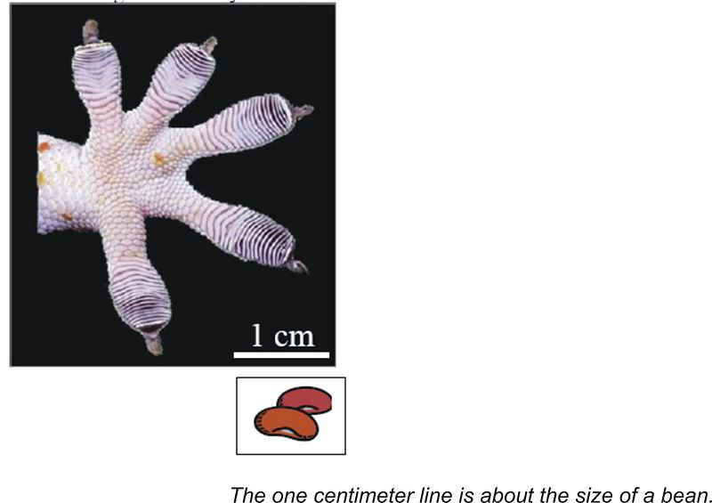

**Image 4.7b: Setae compared with $75 \;\mathrm{micrometers}$** ($0.0075 \;\mathrm{centimeters})$

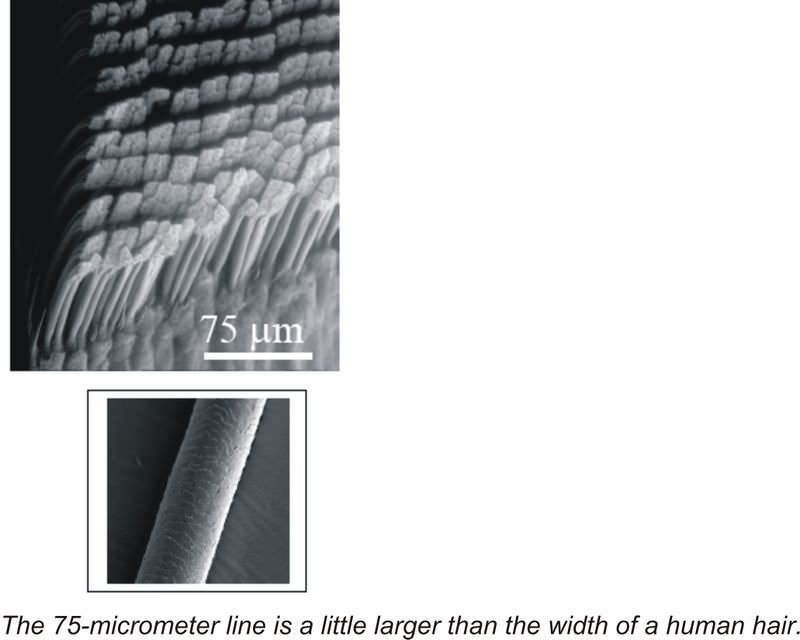

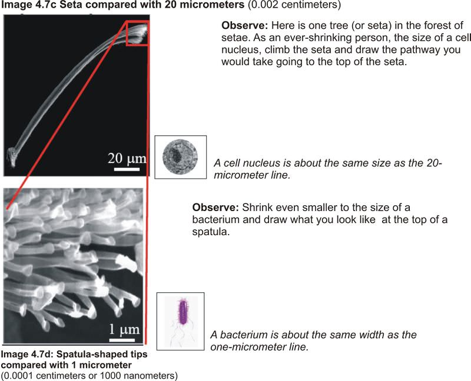

2. What is the significance that each seta contains between $100$ and $1,000$ spatulas?

3. As the scale decreased, what did you find out about the structure of the gecko’s toe?

_Investigating Static Forces in Nature: The Mystery of the Gecko_

Lesson 4: What Do We Learn When We Look More Closely?

Student Journal

© 2009 McREL

</article>

## 5.0 What Types of Forces Can Hold Objects Together?

<article>

</article>

### 5.1 Investigating Static Forces in Nature: The Mystery of the Gecko

<article>

**Activity: What Sticks?**

**Slide 3**

| Station | Materials/Suggested Procedure | Which Objects Stick Together? | How They Stick Together (In Your Own Words) | Adhesion Method (Circle Your Answer) |
| --- | --- | --- | --- | --- |
| 1   | Magnets, Paperclips, Plastic Transparency  Place paperclip on top of the plastic transparency  Slowly tilt transparency on an angle until the paper clip begins to slide  Repeat by clipping the paperclip to the transparency  Repeat with the magnet and plastic transparency |     |     | Friction  Suction  Micro-Interlocking  Magnetic  Static Electricity  Capillary Wet Adhesion  Electrical |
| 2   | Suction Cups, Plastic Transparency  Stick the suction cup to the plastic transparency and turn it upside down |     |     | Friction  Suction  Micro-Interlocking  Magnetic  Static Electricity  Capillary Wet Adhesion  Electrical |
| 3   | Fur or Wool, Balloon, and Plastic Transparency  Rub the balloon with the fur and stick the balloon to the plastic transparency and turn it upside down |     |     | Friction  Suction  Micro-Interlocking  Magnetic  Static Electricity  Capillary Wet Adhesion  Electrical |
| 4   | Beaker of Water, Paper Towel, Plastic Transparency  Place a $5 \mathrm{cm}$. strip of paper towel into water and stick the paper towel strip to the plastic transparency and turn it upside down |     |     | Friction  Suction  Micro-Interlocking  Magnetic  Static Electricity  Capillary Wet Adhesion  Electrical |
| 5   | Washers, Velcro$^\circledR$, Plastic Transparency  First, attach the Velcro$^\circledR$ to the plastic transparency and turn it upside down. Then, attach the Velcro$^\circledR$ to both sides of another piece of Velcro$^\circledR$ Turn each upside down. |     |     | Friction  Suction  Micro-Interlocking  Magnetic  Static Electricity  Capillary Wet Adhesion  Electrical |
| 6   | Transparent Tape and Plastic Transparency  Place the tape on the plastic transparency and turn it upside down |     |     | Friction  Suction  Micro-Interlocking  Magnetic  Static Electricity  Capillary Wet Adhesion  Electrical |
| Additional Station 7 (Optional) |     |     |     |     |
| Additional Station 8 (Optional) |     |     |     |     |
| Additional Station 9 (Optional) |     |     |     |     |

1. Choose one pair of objects that stuck together. Describe factors (variables) that affect how well those two objects stick together.

\_\_\_\_\_\_\_\_\_\_\_\_\_\_\_\_\_\_\_\_\_\_\_\_\_\_\_\_\_\_\_\_\_\_\_\_\_\_\_\_\_\_\_\_\_\_\_\_\_\_\_\_\_\_\_\_\_\_\_\_\_\_

\_\_\_\_\_\_\_\_\_\_\_\_\_\_\_\_\_\_\_\_\_\_\_\_\_\_\_\_\_\_\_\_\_\_\_\_\_\_\_\_\_\_\_\_\_\_\_\_\_\_\_\_\_\_\_\_\_\_\_\_\_\_

\_\_\_\_\_\_\_\_\_\_\_\_\_\_\_\_\_\_\_\_\_\_\_\_\_\_\_\_\_\_\_\_\_\_\_\_\_\_\_\_\_\_\_\_\_\_\_\_\_\_\_\_\_\_\_\_\_\_\_\_\_\_

\_\_\_\_\_\_\_\_\_\_\_\_\_\_\_\_\_\_\_\_\_\_\_\_\_\_\_\_\_\_\_\_\_\_\_\_\_\_\_\_\_\_\_\_\_\_\_\_\_\_\_\_\_\_\_\_\_\_\_\_\_\_

2. Describe an adhesive in your own words. What are the properties that make it work?

\_\_\_\_\_\_\_\_\_\_\_\_\_\_\_\_\_\_\_\_\_\_\_\_\_\_\_\_\_\_\_\_\_\_\_\_\_\_\_\_\_\_\_\_\_\_\_\_\_\_\_\_\_\_\_\_\_\_\_\_\_\_

\_\_\_\_\_\_\_\_\_\_\_\_\_\_\_\_\_\_\_\_\_\_\_\_\_\_\_\_\_\_\_\_\_\_\_\_\_\_\_\_\_\_\_\_\_\_\_\_\_\_\_\_\_\_\_\_\_\_\_\_\_\_

\_\_\_\_\_\_\_\_\_\_\_\_\_\_\_\_\_\_\_\_\_\_\_\_\_\_\_\_\_\_\_\_\_\_\_\_\_\_\_\_\_\_\_\_\_\_\_\_\_\_\_\_\_\_\_\_\_\_\_\_\_\_

\_\_\_\_\_\_\_\_\_\_\_\_\_\_\_\_\_\_\_\_\_\_\_\_\_\_\_\_\_\_\_\_\_\_\_\_\_\_\_\_\_\_\_\_\_\_\_\_\_\_\_\_\_\_\_\_\_\_\_\_\_\_

3. Which factors or variables are testable and which are not?

\_\_\_\_\_\_\_\_\_\_\_\_\_\_\_\_\_\_\_\_\_\_\_\_\_\_\_\_\_\_\_\_\_\_\_\_\_\_\_\_\_\_\_\_\_\_\_\_\_\_\_\_\_\_\_\_\_\_\_\_\_\_

\_\_\_\_\_\_\_\_\_\_\_\_\_\_\_\_\_\_\_\_\_\_\_\_\_\_\_\_\_\_\_\_\_\_\_\_\_\_\_\_\_\_\_\_\_\_\_\_\_\_\_\_\_\_\_\_\_\_\_\_\_\_

\_\_\_\_\_\_\_\_\_\_\_\_\_\_\_\_\_\_\_\_\_\_\_\_\_\_\_\_\_\_\_\_\_\_\_\_\_\_\_\_\_\_\_\_\_\_\_\_\_\_\_\_\_\_\_\_\_\_\_\_\_\_

4. Describe how you made your observations in today’s lesson:

a. What senses/tools did you use?

\_\_\_\_\_\_\_\_\_\_\_\_\_\_\_\_\_\_\_\_\_\_\_\_\_\_\_\_\_\_\_\_\_\_\_\_\_\_\_\_\_\_\_\_\_\_\_\_\_\_\_\_\_\_\_\_\_\_\_\_\_\_

\_\_\_\_\_\_\_\_\_\_\_\_\_\_\_\_\_\_\_\_\_\_\_\_\_\_\_\_\_\_\_\_\_\_\_\_\_\_\_\_\_\_\_\_\_\_\_\_\_\_\_\_\_\_\_\_\_\_\_\_\_\_

b. What observations of forces were at the visible scale?

\_\_\_\_\_\_\_\_\_\_\_\_\_\_\_\_\_\_\_\_\_\_\_\_\_\_\_\_\_\_\_\_\_\_\_\_\_\_\_\_\_\_\_\_\_\_\_\_\_\_\_\_\_\_\_\_\_\_\_\_\_\_

\_\_\_\_\_\_\_\_\_\_\_\_\_\_\_\_\_\_\_\_\_\_\_\_\_\_\_\_\_\_\_\_\_\_\_\_\_\_\_\_\_\_\_\_\_\_\_\_\_\_\_\_\_\_\_\_\_\_\_\_\_\_

c. What dominant forces did you observe?

\_\_\_\_\_\_\_\_\_\_\_\_\_\_\_\_\_\_\_\_\_\_\_\_\_\_\_\_\_\_\_\_\_\_\_\_\_\_\_\_\_\_\_\_\_\_\_\_\_\_\_\_\_\_\_\_\_\_\_\_\_\_

\_\_\_\_\_\_\_\_\_\_\_\_\_\_\_\_\_\_\_\_\_\_\_\_\_\_\_\_\_\_\_\_\_\_\_\_\_\_\_\_\_\_\_\_\_\_\_\_\_\_\_\_\_\_\_\_\_\_\_\_\_\_

d. What are other forces that you observed that may be at the invisible scale?

\_\_\_\_\_\_\_\_\_\_\_\_\_\_\_\_\_\_\_\_\_\_\_\_\_\_\_\_\_\_\_\_\_\_\_\_\_\_\_\_\_\_\_\_\_\_\_\_\_\_\_\_\_\_\_\_\_\_\_\_\_\_

\_\_\_\_\_\_\_\_\_\_\_\_\_\_\_\_\_\_\_\_\_\_\_\_\_\_\_\_\_\_\_\_\_\_\_\_\_\_\_\_\_\_\_\_\_\_\_\_\_\_\_\_\_\_\_\_\_\_\_\_\_\_

**_Homework:_** **Based on the factors that you determined are testable, write a plan to determine how a factor could be tested. Write it as an experimental procedure on a separate sheet of paper.**

**Slide 7: Adhesion Methods Debrief Chart**

**Directions:** Based on your exploration, list examples of each type of adhesion method in the chart on the next page. Complete the first three columns on your own based on your previous work in the stations.

Then, within a small group, you will investigate some research findings on a specific adhesion method and consider whether it is a possible method for gecko adhesion. Your group will write down notes on a separate _Adhesion Methods Student Handout_ and present this information to the rest of the class.

During the class presentations, return to the chart to complete the remaining columns.

| Method | Definition (In Your Own Words) | Drawing That Describes the Method | Examples from Experiment Stations (Slide 7) | Is this method a possible answer to the gecko mystery? (Yes or No) | Why or Why Not? |
| --- | --- | --- | --- | --- | --- |
| **Mechanical Force: Friction** |     |     |     |     |     |
| **Mechanical Force: Air pressure (suction cups)** |     |     |     |     |     |
| **Mechanical Force: Microinterlocking** |     |     |     |     |     |
| **Intermolecular Force: Magnetic** |     |     |     |     |     |
| **Intermolecular Force: Static Electricity** |     |     |     |     |     |
| **Intermolecular Force: Electrical (Capillary Wet Adhesion)** |     |     |     |     |     |
| **Intermolecular Force: Electrical (Tape)** |     |     |     |     |     |

5. Which method is the most likely one that explains the gecko problem? Why?

\_\_\_\_\_\_\_\_\_\_\_\_\_\_\_\_\_\_\_\_\_\_\_\_\_\_\_\_\_\_\_\_\_\_\_\_\_\_\_\_\_\_\_\_\_\_\_\_\_\_\_\_\_\_\_\_\_\_\_\_\_\_

\_\_\_\_\_\_\_\_\_\_\_\_\_\_\_\_\_\_\_\_\_\_\_\_\_\_\_\_\_\_\_\_\_\_\_\_\_\_\_\_\_\_\_\_\_\_\_\_\_\_\_\_\_\_\_\_\_\_\_\_\_\_

\_\_\_\_\_\_\_\_\_\_\_\_\_\_\_\_\_\_\_\_\_\_\_\_\_\_\_\_\_\_\_\_\_\_\_\_\_\_\_\_\_\_\_\_\_\_\_\_\_\_\_\_\_\_\_\_\_\_\_\_\_\_

\_\_\_\_\_\_\_\_\_\_\_\_\_\_\_\_\_\_\_\_\_\_\_\_\_\_\_\_\_\_\_\_\_\_\_\_\_\_\_\_\_\_\_\_\_\_\_\_\_\_\_\_\_\_\_\_\_\_\_\_\_\_

**Adhesion Methods Student Handout**

Each team will be assigned to one of the seven adhesion methods indicated below. Read the information about each one, define it in your own words, draw a picture of the method, and then answer the question(s) for your assigned adhesion method.

\_\_\_\_\_\_\_\_\_\_\_\_\_\_\_\_\_\_\_\_\_\_\_\_\_\_\_\_\_\_\_\_\_\_\_\_\_\_\_\_\_\_\_\_\_\_\_\_\_\_\_\_\_\_\_\_\_\_\_\_\_\_

|     |     |     |
| --- | --- | --- |Mechanical Force: Friction
| Friction | Friction In Your Own Words | Drawing of Friction |
| --- | --- | --- |
| Friction is a force that opposes the lateral (side-to-side) motion of two surfaces that are in contact.  While there is friction between the gecko’s foot and the surface, is this the method by which it adheres? |     |     |

**Questions**

Based on this new information, do you think friction is a possible method for gecko adhesion?

Why or why not?

**Adhesion Methods Student Handout**

Each team will be assigned to one of the seven adhesion methods indicated below. Read the information about each one, define it in your own words, draw a picture of the method, and then answer the question(s) for your assigned adhesion method.

\_\_\_\_\_\_\_\_\_\_\_\_\_\_\_\_\_\_\_\_\_\_\_\_\_\_\_\_\_\_\_\_\_\_\_\_\_\_\_\_\_\_\_\_\_\_\_\_\_\_\_\_\_\_\_\_\_\_\_\_\_\_

|     |     |     |
| --- | --- | --- |Intermolecular Force: Static Electricity
| Static Electricity | Static Electricity In Your Own Words | Drawing of Static Electricity |
| --- | --- | --- |
| Static electricity involves the buildup of charge in objects due to contact between insulators. These charges are generally built up through the flow of electrons from one object to another causing one object to become positively charged and the other object to be negative.  Positively charged objects and negatively charged objects are attracted to each other.  The gecko’s adhesion force is the same whether the surface is charged or uncharged. The gecko’s adhesion force is also the same whether the air is charged or uncharged. |     |     |

**Questions**

Based on this new information, do you think static electricity is a possible method for gecko adhesion?

Why or why not?

**Adhesion Methods Student Handout**

Each team will be assigned to one of the seven adhesion methods indicated below. Read the information about each one, define it in your own words, draw a picture of the method, and then answer the question(s) for your assigned adhesion method.

\_\_\_\_\_\_\_\_\_\_\_\_\_\_\_\_\_\_\_\_\_\_\_\_\_\_\_\_\_\_\_\_\_\_\_\_\_\_\_\_\_\_\_\_\_\_\_\_\_\_\_\_\_\_\_\_\_\_\_\_\_\_

|     |     |     |
| --- | --- | --- |Intermolecular Force: Capillary Wet Adhesion
| Capillary Wet Adhesion (Water) | Capillary Wet Adhesion (Water) In Your Own Words | Drawing of Capillary Wet Adhesion (Water) |
| --- | --- | --- |
| Water molecules are not only attracted to each other, but to any molecule with positive or negative charges. When you place paper from a straw partially into a glass of water, the water will “climb” up the fibers of the straw paper because the water molecules are attracted to the cellulose fibers in the straw paper.  Observations made with geckos indicate that there is no wet trail left behind when geckos walk on a surface. Skin glands are not present on gecko feet—the foot does not have a way to secrete any substance. |     |     |

**Questions**

Based on this new information, do you think capillary wet adhesion is a possible method for gecko adhesion?

Why or why not?

**Adhesion Methods Student Handout**

Each team will be assigned to one of the seven adhesion methods indicated below. Read the information about each one, define it in your own words, draw a picture of the method, and then answer the question(s) for your assigned adhesion method.

\_\_\_\_\_\_\_\_\_\_\_\_\_\_\_\_\_\_\_\_\_\_\_\_\_\_\_\_\_\_\_\_\_\_\_\_\_\_\_\_\_\_\_\_\_\_\_\_\_\_\_\_\_\_\_\_\_\_\_\_\_\_

|     |     |     |
| --- | --- | --- |Mechanical Force: Air Pressure (Suction Cups)
| Air Pressure (Suction Cups) | Air Pressure In Your Own Words | Drawing of Air Pressure |
| --- | --- | --- |
| Air pressure is the force from molecules of air hitting a surface. A suction cup is a device made of either plastic or rubber that sticks to smooth surfaces.  In a suction cup, a partial vacuum (region of low pressure) is created so that there are fewer molecules than before the suction cup was applied to a surface.  Once the suction cup is pressed onto a surface, the air pressure inside the cup is greatly reduced compared with the higher pressure from the surrounding air. This forces the suction cup to stick to the surface.  Gecko force experiments indicate that the same force measurements have occurred when the gecko setae are tested in a vacuum (no air pressure) as in regular air. |     |     |

**Questions**

Based on this new information, do you think suction is a possible method for gecko adhesion?

Why or why not?

**Adhesion Methods Student Handout**

Each team will be assigned to one of the seven adhesion methods indicated below. Read the information about each one, define it in your own words, draw a picture of the method, and then answer the question(s) for your assigned adhesion method.

\_\_\_\_\_\_\_\_\_\_\_\_\_\_\_\_\_\_\_\_\_\_\_\_\_\_\_\_\_\_\_\_\_\_\_\_\_\_\_\_\_\_\_\_\_\_\_\_\_\_\_\_\_\_\_\_\_\_\_\_\_\_

|     |     |     |
| --- | --- | --- |Mechanical Force: Micro-Interlocking
| Micro-Interlocking | Micro-Interlocking In Your Own Words | Drawing of Micro-Interlocking |
| --- | --- | --- |
| Two materials may be mechanically interlocked. One object is linked, hooked, or anchored to another object. At the macroscopic scale, examples include: a zipper, sewing two pieces of cloth with a thread, and two pieces of Velcro$^\circledR$ that are attached.  For the gecko, no interlocking has been observed. In fact, force measurements have been the same amount per unit area for different opposing materials. |     |     |

**Questions**

Based on this new information, do you think micro-interlocking is a possible method for gecko adhesion?

Why or why not?

**Adhesion Methods Student Handout**

Each team will be assigned to one of the seven adhesion methods indicated below. Read the information about each one, define it in your own words, draw a picture of the method, and then answer the question(s) for your assigned adhesion method.

\_\_\_\_\_\_\_\_\_\_\_\_\_\_\_\_\_\_\_\_\_\_\_\_\_\_\_\_\_\_\_\_\_\_\_\_\_\_\_\_\_\_\_\_\_\_\_\_\_\_\_\_\_\_\_\_\_\_\_\_\_\_

|     |     |     |
| --- | --- | --- |Intermolecular Forces: Electrical (Tape)
| Intermolecular Forces: Electrical (Tape) | Intermolecular Forces: Electrical (Tape) Forces In Your Own Words | Drawing of Intermolecular Forces: Electrical (Tape) |
| --- | --- | --- |
| Intermolecular forces are weak electrical forces between molecules that are very close together. For these forces to adhere an object to another, the object must be compliant.  Transparent tape has two layers. The adhesive layer has a structure that at the molecular level has properties similar to a liquid. The other layer has properties more like a solid.  The adhesion layer of the tape makes compliant contact with the surface so that more intermolecular electrical attractions can occur.  For this method to be considered a possibility for gecko adhesion, each seta must have properties similar to the tape. This would then allow the seta to make compliant contact with the opposing surface. |     |     |

**Questions**

Based on this new information, do you think intermolecular forces are a possible method for gecko adhesion?

Why or why not?

**Adhesion Methods Student Handout**

Each team will be assigned to one of the seven adhesion methods indicated below. Read the information about each one, define it in your own words, draw a picture of the method, and then answer the question(s) for your assigned adhesion method.

\_\_\_\_\_\_\_\_\_\_\_\_\_\_\_\_\_\_\_\_\_\_\_\_\_\_\_\_\_\_\_\_\_\_\_\_\_\_\_\_\_\_\_\_\_\_\_\_\_\_\_\_\_\_\_\_\_\_\_\_\_\_

|     |     |     |
| --- | --- | --- |Intermolecular Force: Magnetic
| Magnetic | Magnetic In Your Own Words | Drawing of Magnetic |
| --- | --- | --- |
| A magnet is an object with a magnetic field. A “hard” magnet is one which stays magnetized for a long time.  A “soft” magnet is one which loses its magnetic properties. Opposite poles of magnets attract. |     |     |

**Questions**

Based on this new information, do you think magnetic force is a possible method for gecko adhesion?

Why or why not?

_Investigating Static Forces in Nature: The Mystery of the Gecko_

Adhesion Methods Student Handout

© 2009 McREL

</article>

## 6.0 How Much Force Is Needed to Make an Object Stick? What Factors Affect the Strength of Force Acting on an Object?

<article>

</article>

### 6.1 Investigating Static Forces in Nature: The Mystery of the Gecko

<article>

**Slide 1**

Draw one example of balanced forces and one example of unbalanced forces from your classroom in the boxes below. Use arrows to indicate the direction of the forces. Draw large arrows for large forces and small arrows for small forces.

| Example of balanced Force | Example of Unbalanced Force |
| --- | --- |

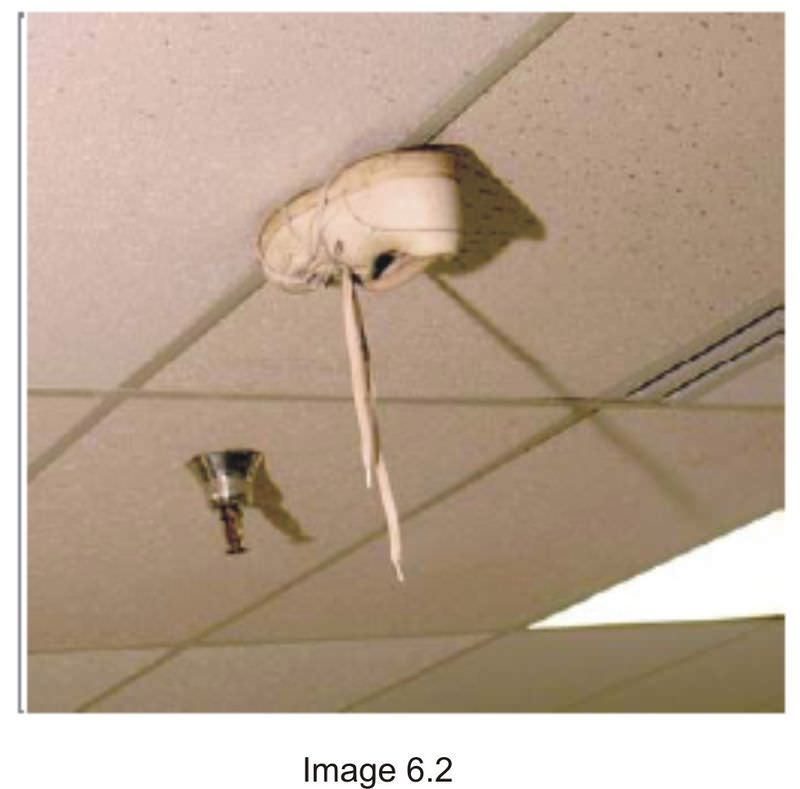

When an object is sticking to a ceiling, what are the two forces that come into play? In order for the shoe to remain on the ceiling, what must be true about these forces?

\_\_\_\_\_\_\_\_\_\_\_\_\_\_\_\_\_\_\_\_\_\_\_\_\_\_\_\_\_\_\_\_\_\_\_\_\_\_\_\_\_\_\_\_\_\_\_\_\_\_\_\_\_\_\_\_\_\_\_\_\_\_

\_\_\_\_\_\_\_\_\_\_\_\_\_\_\_\_\_\_\_\_\_\_\_\_\_\_\_\_\_\_\_\_\_\_\_\_\_\_\_\_\_\_\_\_\_\_\_\_\_\_\_\_\_\_\_\_\_\_\_\_\_\_

\_\_\_\_\_\_\_\_\_\_\_\_\_\_\_\_\_\_\_\_\_\_\_\_\_\_\_\_\_\_\_\_\_\_\_\_\_\_\_\_\_\_\_\_\_\_\_\_\_\_\_\_\_\_\_\_\_\_\_\_\_\_

\_\_\_\_\_\_\_\_\_\_\_\_\_\_\_\_\_\_\_\_\_\_\_\_\_\_\_\_\_\_\_\_\_\_\_\_\_\_\_\_\_\_\_\_\_\_\_\_\_\_\_\_\_\_\_\_\_\_\_\_\_\_

\_\_\_\_\_\_\_\_\_\_\_\_\_\_\_\_\_\_\_\_\_\_\_\_\_\_\_\_\_\_\_\_\_\_\_\_\_\_\_\_\_\_\_\_\_\_\_\_\_\_\_\_\_\_\_\_\_\_\_\_\_\_

\_\_\_\_\_\_\_\_\_\_\_\_\_\_\_\_\_\_\_\_\_\_\_\_\_\_\_\_\_\_\_\_\_\_\_\_\_\_\_\_\_\_\_\_\_\_\_\_\_\_\_\_\_\_\_\_\_\_\_\_\_\_

\_\_\_\_\_\_\_\_\_\_\_\_\_\_\_\_\_\_\_\_\_\_\_\_\_\_\_\_\_\_\_\_\_\_\_\_\_\_\_\_\_\_\_\_\_\_\_\_\_\_\_\_\_\_\_\_\_\_\_\_\_\_

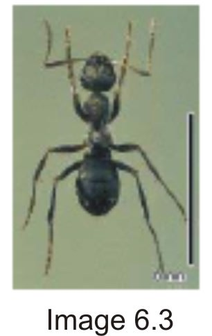

Weight of Ant = $0.00004 \;\mathrm{Newtons}$

Draw and label arrows representing the forces on the ant that is on the ceiling on the diagram below. Then, calculate the force required for each ant foot. (Note: Divide total force by six.) Be sure to show correct units.

**We are assuming in this problem that the total force required is equally divided among the six ant feet, and that ONLY the contact between feet and ceiling gives rise to the force**.

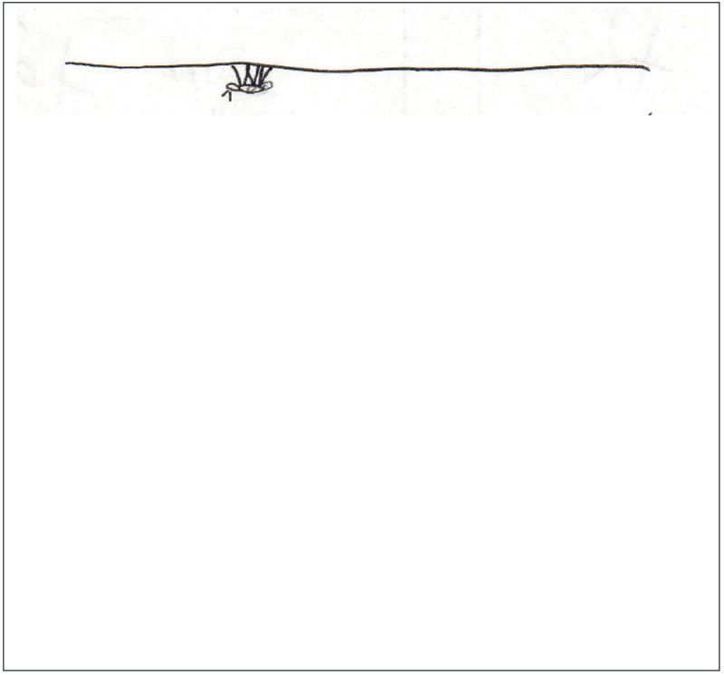

Imagine an object that is larger in every dimension and whose mass and volume is ten times larger than an ant.

How many “ant feet” would it take for this imaginary object to remain adhered to the ceiling? Show your calculations below. Be sure to show correct units.

**Slide 5**

Now, apply this calculation for the Tokay Gecko, which has an average weight of 2.2 Newtons. How many “ant feet” would it take for the gecko to remain adhered to the ceiling? Be sure to show correct units.

Write a statement and/or draw pictures that describe the relationship between size (mass) and weight and, therefore, adhesive forces required for an animal to remain on a ceiling.

**Slide 8**

How could one measure the amount of “stickiness” of a piece of tape on a tabletop?

\_\_\_\_\_\_\_\_\_\_\_\_\_\_\_\_\_\_\_\_\_\_\_\_\_\_\_\_\_\_\_\_\_\_\_\_\_\_\_\_\_\_\_\_\_\_\_\_\_\_\_\_\_\_\_\_\_\_\_\_\_\_

\_\_\_\_\_\_\_\_\_\_\_\_\_\_\_\_\_\_\_\_\_\_\_\_\_\_\_\_\_\_\_\_\_\_\_\_\_\_\_\_\_\_\_\_\_\_\_\_\_\_\_\_\_\_\_\_\_\_\_\_\_\_

\_\_\_\_\_\_\_\_\_\_\_\_\_\_\_\_\_\_\_\_\_\_\_\_\_\_\_\_\_\_\_\_\_\_\_\_\_\_\_\_\_\_\_\_\_\_\_\_\_\_\_\_\_\_\_\_\_\_\_\_\_\_

\_\_\_\_\_\_\_\_\_\_\_\_\_\_\_\_\_\_\_\_\_\_\_\_\_\_\_\_\_\_\_\_\_\_\_\_\_\_\_\_\_\_\_\_\_\_\_\_\_\_\_\_\_\_\_\_\_\_\_\_\_\_

\_\_\_\_\_\_\_\_\_\_\_\_\_\_\_\_\_\_\_\_\_\_\_\_\_\_\_\_\_\_\_\_\_\_\_\_\_\_\_\_\_\_\_\_\_\_\_\_\_\_\_\_\_\_\_\_\_\_\_\_\_\_

The fundamental assumption in testing for adhesion is that the force that holds the tape in place is the same as the force required to remove it. This is NOT true. The force required to remove the tape is actually a lot greater. Much of the separation force is going to extend the adhesive prior to separation and to bend the backing. However, it is the most practical form of adhesion testing available.”

Adapted from Johnston, J. (2003). _Pressure sensitive adhesive tapes_. Pressure Sensitive Tape Council. Northbrook, Illinois, page 154.

**Experiment: Tape Pull**

**Question**: How does the amount of dirt affect the amount of force required to lift a piece of tape from the tabletop?

**Materials**: transparent tape, duct tape, spring scale, hole punch, metric ruler, protractor

**Procedure Practice:**

Set up your testing apparatus as shown below.

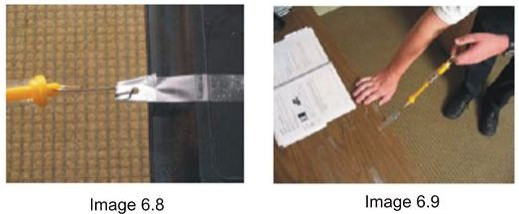

1. Place some transparent tape onto a desk or lab table so that half of the tape is hanging off the edge.

2. Measure the amount of surface area of tabletop that the tape touches (Area = Length times Width).

Area =

3. Use duct tape to make a reinforced end on the tape that is not touching the tabletop.

4. Use the hole-punch to make a hole through the duct tape and the transparent tape.

5. Place the hook end of the spring scale into the hole.

6. Practice pulling the spring scale to measure the amount of force needed to remove the tape from the tabletop.

7. Record your observations from this practice below.

**Procedure Experiment:**

1. Hypothesis: Write a hypothesis below:

If the amount of dirt on the tape \_\_\_\_\_\_\_\_\_\_\_\_\_\_\_\_\_\_\_\_ (increases or decreases), then the force required to remove the tape \_\_\_\_\_\_\_\_\_\_\_\_\_\_\_\_\_\_\_\_\_ (increases or decreases).

2. Based on your practice trials:

A. What was the independent variable (variable you were testing)?

B. What was the dependent variable (variable being measured)?

3. Write your procedure (in the box below) for testing the force needed to remove transparent tape from the tabletop with varying amounts of dirt. Be sure to include the proposed amount of dirt for the experiment. How will you vary the amount of dirt? (e.g., clean, somewhat dirty, and very dirty).

4. Remember that you are measuring the effect that the amount of dirt has on the force needed to remove the transparent tape. All other variables should be held constant including the angle of pull, the amount of tape that is in contact with the tabletop, etc. What other variables should be held constant?

\_\_\_\_\_\_\_\_\_\_\_\_\_\_\_\_\_\_\_\_\_\_\_\_\_\_\_\_\_\_\_\_\_\_\_\_\_\_\_\_\_\_\_\_\_\_\_\_\_\_\_\_\_\_\_\_\_\_\_\_\_\_

\_\_\_\_\_\_\_\_\_\_\_\_\_\_\_\_\_\_\_\_\_\_\_\_\_\_\_\_\_\_\_\_\_\_\_\_\_\_\_\_\_\_\_\_\_\_\_\_\_\_\_\_\_\_\_\_\_\_\_\_\_\_

\_\_\_\_\_\_\_\_\_\_\_\_\_\_\_\_\_\_\_\_\_\_\_\_\_\_\_\_\_\_\_\_\_\_\_\_\_\_\_\_\_\_\_\_\_\_\_\_\_\_\_\_\_\_\_\_\_\_\_\_\_\_

5. Record your data in the box below. You should test the same amount of dirt for at least three trials and then determine the average force (in Newtons) that it took to remove the tape from the tabletop. Make sure you make both quantitative (force measurements) and qualitative (notes and drawings) for your data tables.

**Analysis/Interpretation**

6. Based on the information in your data table, write an answer to the original research question above.

\_\_\_\_\_\_\_\_\_\_\_\_\_\_\_\_\_\_\_\_\_\_\_\_\_\_\_\_\_\_\_\_\_\_\_\_\_\_\_\_\_\_\_\_\_\_\_\_\_\_\_\_\_\_\_\_\_\_\_\_\_\_

\_\_\_\_\_\_\_\_\_\_\_\_\_\_\_\_\_\_\_\_\_\_\_\_\_\_\_\_\_\_\_\_\_\_\_\_\_\_\_\_\_\_\_\_\_\_\_\_\_\_\_\_\_\_\_\_\_\_\_\_\_\_

\_\_\_\_\_\_\_\_\_\_\_\_\_\_\_\_\_\_\_\_\_\_\_\_\_\_\_\_\_\_\_\_\_\_\_\_\_\_\_\_\_\_\_\_\_\_\_\_\_\_\_\_\_\_\_\_\_\_\_\_\_\_

7. Describe how you made your observations in today’s lesson:

a. What tools did you use?

\_\_\_\_\_\_\_\_\_\_\_\_\_\_\_\_\_\_\_\_\_\_\_\_\_\_\_\_\_\_\_\_\_\_\_\_\_\_\_\_\_\_\_\_\_\_\_\_\_\_\_\_\_\_\_\_\_\_\_\_\_\_

b. Were your observations at the visible or invisible scale?

\_\_\_\_\_\_\_\_\_\_\_\_\_\_\_\_\_\_\_\_\_\_\_\_\_\_\_\_\_\_\_\_\_\_\_\_\_\_\_\_\_\_\_\_\_\_\_\_\_\_\_\_\_\_\_\_\_\_\_\_\_\_

c. What is the dominant force at this scale?

\_\_\_\_\_\_\_\_\_\_\_\_\_\_\_\_\_\_\_\_\_\_\_\_\_\_\_\_\_\_\_\_\_\_\_\_\_\_\_\_\_\_\_\_\_\_\_\_\_\_\_\_\_\_\_\_\_\_\_\_\_\_

**Graph Your Results Using a Bar Graph**

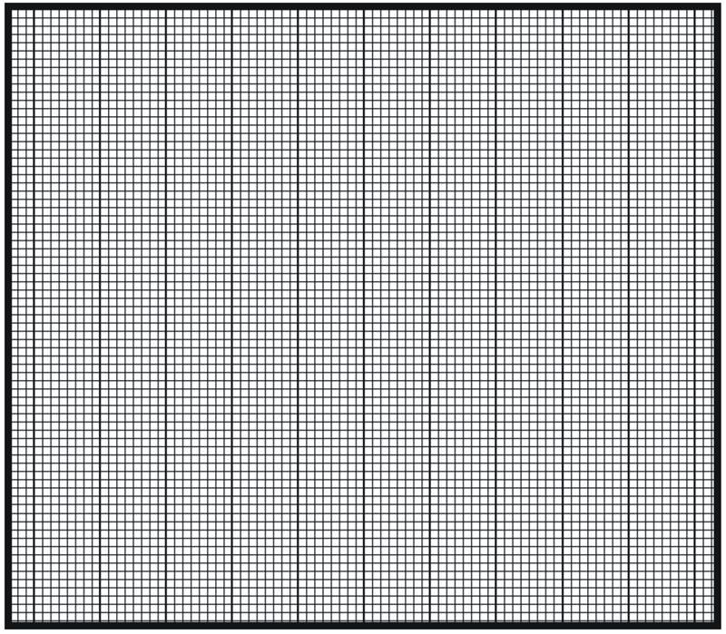

8. Did your data support your hypothesis? Explain.

\_\_\_\_\_\_\_\_\_\_\_\_\_\_\_\_\_\_\_\_\_\_\_\_\_\_\_\_\_\_\_\_\_\_\_\_\_\_\_\_\_\_\_\_\_\_\_\_\_\_\_\_\_\_\_\_\_\_\_\_\_\_

\_\_\_\_\_\_\_\_\_\_\_\_\_\_\_\_\_\_\_\_\_\_\_\_\_\_\_\_\_\_\_\_\_\_\_\_\_\_\_\_\_\_\_\_\_\_\_\_\_\_\_\_\_\_\_\_\_\_\_\_\_\_

\_\_\_\_\_\_\_\_\_\_\_\_\_\_\_\_\_\_\_\_\_\_\_\_\_\_\_\_\_\_\_\_\_\_\_\_\_\_\_\_\_\_\_\_\_\_\_\_\_\_\_\_\_\_\_\_\_\_\_\_\_\_

_Investigating Static Forces in Nature: The Mystery of the Gecko_

Lesson 6: How MUCH Force is Needed to Make an Object Stick?

Student Journal

© 2009 McREL

</article>

## 7.0 How Do We Measure Forces at the Nanoscale Level? Why Is Merely Looking not Enough?

<article>

</article>

### 7.1 Investigating Static Forces in Nature: The Mystery of the Gecko

<article>

**Activity: Topography of the Unknown**

**Slide 2**

What are some instruments (probes) you have used in previous science classes?

\_\_\_\_\_\_\_\_\_\_\_\_\_\_\_\_\_\_\_\_\_\_\_\_\_\_\_\_\_\_\_\_\_\_\_\_\_\_\_\_\_\_\_\_\_\_\_\_\_\_\_\_\_\_\_\_\_\_\_\_\_\_

\_\_\_\_\_\_\_\_\_\_\_\_\_\_\_\_\_\_\_\_\_\_\_\_\_\_\_\_\_\_\_\_\_\_\_\_\_\_\_\_\_\_\_\_\_\_\_\_\_\_\_\_\_\_\_\_\_\_\_\_\_\_

\_\_\_\_\_\_\_\_\_\_\_\_\_\_\_\_\_\_\_\_\_\_\_\_\_\_\_\_\_\_\_\_\_\_\_\_\_\_\_\_\_\_\_\_\_\_\_\_\_\_\_\_\_\_\_\_\_\_\_\_\_\_

**Slide 3**

**Purpose:**

Scientists use probes to identify the properties of objects, even if they cannot see the objects! In this activity, you will use a height probe to identify and analyze the height differences in an object that you cannot see.

**Materials:**

_One set of materials per group of 2–3 students:_

* Observation box
* Height probe: straightened paperclip at least 6 inches long
* $3$ pieces of scan paper (provided) or graph paper
* Thumbtack
* Ruler
* Pen
* Glue-stick
* Scissors

_For the class:_

* Glue gun

**Procedure:**

**Measuring With the Height Probe**

1. How will you measure the height of the object inside the box using a ruler and height probe with different colored marks?

\_\_\_\_\_\_\_\_\_\_\_\_\_\_\_\_\_\_\_\_\_\_\_\_\_\_\_\_\_\_\_\_\_\_\_\_\_\_\_\_\_\_\_\_\_\_\_\_\_\_\_\_\_\_\_\_\_\_\_\_\_\_

\_\_\_\_\_\_\_\_\_\_\_\_\_\_\_\_\_\_\_\_\_\_\_\_\_\_\_\_\_\_\_\_\_\_\_\_\_\_\_\_\_\_\_\_\_\_\_\_\_\_\_\_\_\_\_\_\_\_\_\_\_\_

\_\_\_\_\_\_\_\_\_\_\_\_\_\_\_\_\_\_\_\_\_\_\_\_\_\_\_\_\_\_\_\_\_\_\_\_\_\_\_\_\_\_\_\_\_\_\_\_\_\_\_\_\_\_\_\_\_\_\_\_\_\_

\_\_\_\_\_\_\_\_\_\_\_\_\_\_\_\_\_\_\_\_\_\_\_\_\_\_\_\_\_\_\_\_\_\_\_\_\_\_\_\_\_\_\_\_\_\_\_\_\_\_\_\_\_\_\_\_\_\_\_\_\_\_

\_\_\_\_\_\_\_\_\_\_\_\_\_\_\_\_\_\_\_\_\_\_\_\_\_\_\_\_\_\_\_\_\_\_\_\_\_\_\_\_\_\_\_\_\_\_\_\_\_\_\_\_\_\_\_\_\_\_\_\_\_\_

Sketch Space

2. Measure the height of the box. Systematically measure the distance from the probe hole to the object for each probe hole. Subtract this distance from the height of the box and **record** your data on the scan area below or on a larger scan paper. These measurements represent the various heights of the object inside the box.

|     | A   | B   | C   | D   | E   | F   | G   | H   | I   | J   | K   | L   | M   | N   |
| --- | --- | --- | --- | --- | --- | --- | --- | --- | --- | --- | --- | --- | --- | --- |
| **1** |     |     |     |     |     |     |     |     |     |     |     |     |     |     |
| **2** |     |     |     |     |     |     |     |     |     |     |     |     |     |     |
| **3** |     |     |     |     |     |     |     |     |     |     |     |     |     |     |
| **4** |     |     |     |     |     |     |     |     |     |     |     |     |     |     |
| **5** |     |     |     |     |     |     |     |     |     |     |     |     |     |     |
| **6** |     |     |     |     |     |     |     |     |     |     |     |     |     |     |
| **7** |     |     |     |     |     |     |     |     |     |     |     |     |     |     |
| **8** |     |     |     |     |     |     |     |     |     |     |     |     |     |     |
| **9** |     |     |     |     |     |     |     |     |     |     |     |     |     |     |

**Slide 4**

**Making a Three-Dimensional Representation of the Objects in Your Box**

1. Open a new spreadsheet in Excel.

2. Select the cells with data. Go to the chart wizard (chart symbol on the toolbar). Choose a surface plot: 2-D or 3-D (try both). Select NEXT at each dialogue box (Don’t worry about labels).

Notes:

* Once you get the chart, you can change the scale of the coloring by double clicking on the legend, going to the scale tab and changing the value for the major unit.
* You can rotate a 3-D chart by clicking on the chart and then dragging the corner dots.

**Analyzing Your Data**

1. Look at the 3-D representation you have created. Describe your object based upon your 3-D representation. Do you see any pattern in the numbers that gives a clue to the structure of the object inside the box? What does it look like?

\_\_\_\_\_\_\_\_\_\_\_\_\_\_\_\_\_\_\_\_\_\_\_\_\_\_\_\_\_\_\_\_\_\_\_\_\_\_\_\_\_\_\_\_\_\_\_\_\_\_\_\_\_\_\_\_\_\_\_\_\_\_

\_\_\_\_\_\_\_\_\_\_\_\_\_\_\_\_\_\_\_\_\_\_\_\_\_\_\_\_\_\_\_\_\_\_\_\_\_\_\_\_\_\_\_\_\_\_\_\_\_\_\_\_\_\_\_\_\_\_\_\_\_\_

2. Optional: Open your box and compare to the graph you just created.

3. Optional: Print and staple your graph to this journal page.

**Activity: Modeling an AFM with a Refrigerator Magnet**

**Procedure:**

Use a refrigerator magnet to simulate and AFM probing a surface. The magnetic probe strip represents the scanning probe tip of an AFM. The refrigerator magnet represents a nanoparticle sample.

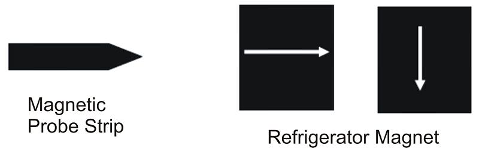

2. As you know, the north pole of a magnet will attract the south pole of another magnet, and two magnets with either their north poles or their south poles pointed at each other will repel.

3. With this in mind, draw a representation of the magnetic poles in the box below.

* Be sure to include the number of up and down deflections that you observe as you

probe your “nanoparticle.”

* What is the distance between the up and down deflections?

\_\_\_\_\_\_\_\_\_\_\_\_\_\_\_\_\_\_\_\_\_\_\_\_\_\_\_\_\_\_\_\_\_\_\_\_\_\_\_\_\_\_\_\_\_\_\_\_\_\_\_\_\_\_\_\_\_\_\_\_\_\_

* Are these distances uniform all the way across the surface, and in all directions?

\_\_\_\_\_\_\_\_\_\_\_\_\_\_\_\_\_\_\_\_\_\_\_\_\_\_\_\_\_\_\_\_\_\_\_\_\_\_\_\_\_\_\_\_\_\_\_\_\_\_\_\_\_\_\_\_\_\_\_\_\_\_

**Top View Looking Down on the Magnet Surface**

**Slide 6**

|     | AFM | Box Model |
| --- | --- | --- |
| What characteristic is measured by the probe? |     |     |
| How is the characteristic measured by the probe? |     |     |

**Slides 8–11**

1. Describe using words how the spatula-shaped tips come into contact with a surface. How does the number of model spatulas on a gecko seta affect the amount of surface contact?

\_\_\_\_\_\_\_\_\_\_\_\_\_\_\_\_\_\_\_\_\_\_\_\_\_\_\_\_\_\_\_\_\_\_\_\_\_\_\_\_\_\_\_\_\_\_\_\_\_\_\_\_\_\_\_\_\_\_\_\_\_\_

\_\_\_\_\_\_\_\_\_\_\_\_\_\_\_\_\_\_\_\_\_\_\_\_\_\_\_\_\_\_\_\_\_\_\_\_\_\_\_\_\_\_\_\_\_\_\_\_\_\_\_\_\_\_\_\_\_\_\_\_\_\_

 as to how the gecko adheres to a wall. Are there some methods that you could eliminate because of the new information you now have? What evidence do you now have that supports the remaining possible adhesive methods?")

\_\_\_\_\_\_\_\_\_\_\_\_\_\_\_\_\_\_\_\_\_\_\_\_\_\_\_\_\_\_\_\_\_\_\_\_\_\_\_\_\_\_\_\_\_\_\_\_\_\_\_\_\_\_\_\_\_\_\_\_\_\_

\_\_\_\_\_\_\_\_\_\_\_\_\_\_\_\_\_\_\_\_\_\_\_\_\_\_\_\_\_\_\_\_\_\_\_\_\_\_\_\_\_\_\_\_\_\_\_\_\_\_\_\_\_\_\_\_\_\_\_\_\_\_

\_\_\_\_\_\_\_\_\_\_\_\_\_\_\_\_\_\_\_\_\_\_\_\_\_\_\_\_\_\_\_\_\_\_\_\_\_\_\_\_\_\_\_\_\_\_\_\_\_\_\_\_\_\_\_\_\_\_\_\_\_\_

3. What new questions do you have about surface-to-surface interactions?

\_\_\_\_\_\_\_\_\_\_\_\_\_\_\_\_\_\_\_\_\_\_\_\_\_\_\_\_\_\_\_\_\_\_\_\_\_\_\_\_\_\_\_\_\_\_\_\_\_\_\_\_\_\_\_\_\_\_\_\_\_\_

\_\_\_\_\_\_\_\_\_\_\_\_\_\_\_\_\_\_\_\_\_\_\_\_\_\_\_\_\_\_\_\_\_\_\_\_\_\_\_\_\_\_\_\_\_\_\_\_\_\_\_\_\_\_\_\_\_\_\_\_\_\_

**Slide 13**

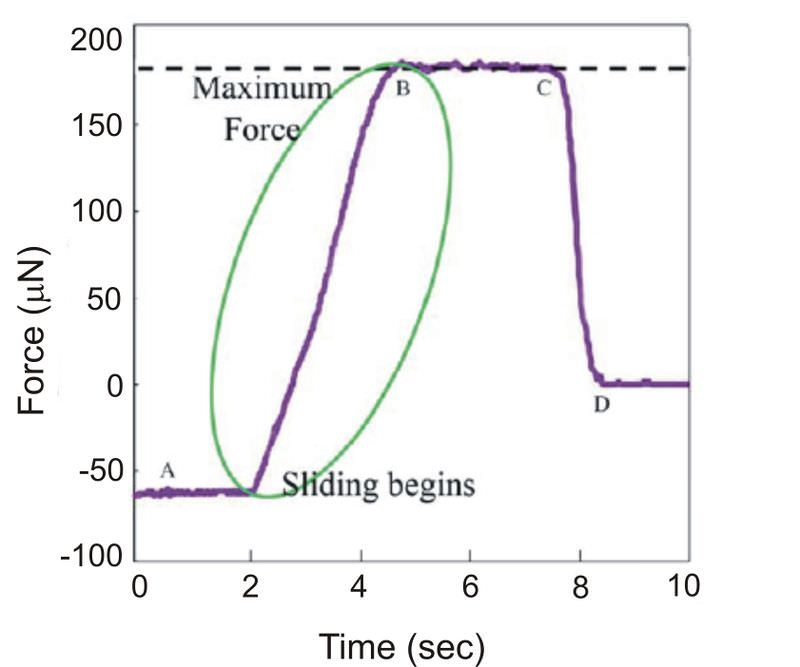

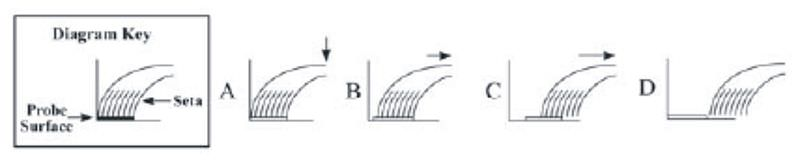

1. What is being shown on the $X-$axis and $Y-$axis?

\_\_\_\_\_\_\_\_\_\_\_\_\_\_\_\_\_\_\_\_\_\_\_\_\_\_\_\_\_\_\_\_\_\_\_\_\_\_\_\_\_\_\_\_\_\_\_\_\_\_\_\_\_\_\_\_\_\_\_\_\_\_

\_\_\_\_\_\_\_\_\_\_\_\_\_\_\_\_\_\_\_\_\_\_\_\_\_\_\_\_\_\_\_\_\_\_\_\_\_\_\_\_\_\_\_\_\_\_\_\_\_\_\_\_\_\_\_\_\_\_\_\_\_\_

2. What units are being used?

\_\_\_\_\_\_\_\_\_\_\_\_\_\_\_\_\_\_\_\_\_\_\_\_\_\_\_\_\_\_\_\_\_\_\_\_\_\_\_\_\_\_\_\_\_\_\_\_\_\_\_\_\_\_\_\_\_\_\_\_\_\_

\_\_\_\_\_\_\_\_\_\_\_\_\_\_\_\_\_\_\_\_\_\_\_\_\_\_\_\_\_\_\_\_\_\_\_\_\_\_\_\_\_\_\_\_\_\_\_\_\_\_\_\_\_\_\_\_\_\_\_\_\_\_

3. What does the oval represent? (It should be noted that adhesion is enhanced during this timeframe on the graph.)

\_\_\_\_\_\_\_\_\_\_\_\_\_\_\_\_\_\_\_\_\_\_\_\_\_\_\_\_\_\_\_\_\_\_\_\_\_\_\_\_\_\_\_\_\_\_\_\_\_\_\_\_\_\_\_\_\_\_\_\_\_\_

\_\_\_\_\_\_\_\_\_\_\_\_\_\_\_\_\_\_\_\_\_\_\_\_\_\_\_\_\_\_\_\_\_\_\_\_\_\_\_\_\_\_\_\_\_\_\_\_\_\_\_\_\_\_\_\_\_\_\_\_\_\_

4. What is the maximum force that is measured for adhesion?

\_\_\_\_\_\_\_\_\_\_\_\_\_\_\_\_\_\_\_\_\_\_\_\_\_\_\_\_\_\_\_\_\_\_\_\_\_\_\_\_\_\_\_\_\_\_\_\_\_\_\_\_\_\_\_\_\_\_\_\_\_\_

\_\_\_\_\_\_\_\_\_\_\_\_\_\_\_\_\_\_\_\_\_\_\_\_\_\_\_\_\_\_\_\_\_\_\_\_\_\_\_\_\_\_\_\_\_\_\_\_\_\_\_\_\_\_\_\_\_\_\_\_\_\_

5. Knowing that there are $1 \;\mathrm{million}$ setae on all four feet, is this enough force to hold up a $2.2 \;\mathrm{Newton}$ gecko?

\_\_\_\_\_\_\_\_\_\_\_\_\_\_\_\_\_\_\_\_\_\_\_\_\_\_\_\_\_\_\_\_\_\_\_\_\_\_\_\_\_\_\_\_\_\_\_\_\_\_\_\_\_\_\_\_\_\_\_\_\_\_

\_\_\_\_\_\_\_\_\_\_\_\_\_\_\_\_\_\_\_\_\_\_\_\_\_\_\_\_\_\_\_\_\_\_\_\_\_\_\_\_\_\_\_\_\_\_\_\_\_\_\_\_\_\_\_\_\_\_\_\_\_\_

| What’s Happening to the Seta? (Diagrams below the graph) | What’s Happening to the Force of Adhesion? (Slope of graph) |
| --- | --- |
| Between Points A and B | Between Points A and B |
| Between Points B and C | Between Points B and C |
| Between Points C and D | Between Points C and D |

At what point does the seta completely leave the probe surface? Explain your answer in terms of time and amount of force shown on the graph.

\_\_\_\_\_\_\_\_\_\_\_\_\_\_\_\_\_\_\_\_\_\_\_\_\_\_\_\_\_\_\_\_\_\_\_\_\_\_\_\_\_\_\_\_\_\_\_\_\_\_\_\_\_\_\_\_\_\_\_\_\_\_

\_\_\_\_\_\_\_\_\_\_\_\_\_\_\_\_\_\_\_\_\_\_\_\_\_\_\_\_\_\_\_\_\_\_\_\_\_\_\_\_\_\_\_\_\_\_\_\_\_\_\_\_\_\_\_\_\_\_\_\_\_\_

\_\_\_\_\_\_\_\_\_\_\_\_\_\_\_\_\_\_\_\_\_\_\_\_\_\_\_\_\_\_\_\_\_\_\_\_\_\_\_\_\_\_\_\_\_\_\_\_\_\_\_\_\_\_\_\_\_\_\_\_\_\_

_Investigating Static Forces in Nature: The Mystery of the Gecko_

Lesson 7: How Do We Measure Forces at the Nanoscale Level?

Student Journal

© 2009 McREL

</article>

## 8.0 How Can a Gecko Walk on a Ceiling?.

<article>

</article>

### 8.1 Investigating Static Forces in Nature: The Mystery of the Gecko

<article>

**Slide 2**

How do the spatula-shaped tips of the setae come into close contact with the surface?

\_\_\_\_\_\_\_\_\_\_\_\_\_\_\_\_\_\_\_\_\_\_\_\_\_\_\_\_\_\_\_\_\_\_\_\_\_\_\_\_\_\_\_\_\_\_\_\_\_\_\_\_\_\_\_\_\_\_\_\_\_\_

\_\_\_\_\_\_\_\_\_\_\_\_\_\_\_\_\_\_\_\_\_\_\_\_\_\_\_\_\_\_\_\_\_\_\_\_\_\_\_\_\_\_\_\_\_\_\_\_\_\_\_\_\_\_\_\_\_\_\_\_\_\_

\_\_\_\_\_\_\_\_\_\_\_\_\_\_\_\_\_\_\_\_\_\_\_\_\_\_\_\_\_\_\_\_\_\_\_\_\_\_\_\_\_\_\_\_\_\_\_\_\_\_\_\_\_\_\_\_\_\_\_\_\_\_

\_\_\_\_\_\_\_\_\_\_\_\_\_\_\_\_\_\_\_\_\_\_\_\_\_\_\_\_\_\_\_\_\_\_\_\_\_\_\_\_\_\_\_\_\_\_\_\_\_\_\_\_\_\_\_\_\_\_\_\_\_\_

**Slide 3**

How is the gecko seta similar to the transparent tape example?

\_\_\_\_\_\_\_\_\_\_\_\_\_\_\_\_\_\_\_\_\_\_\_\_\_\_\_\_\_\_\_\_\_\_\_\_\_\_\_\_\_\_\_\_\_\_\_\_\_\_\_\_\_\_\_\_\_\_\_\_\_\_

\_\_\_\_\_\_\_\_\_\_\_\_\_\_\_\_\_\_\_\_\_\_\_\_\_\_\_\_\_\_\_\_\_\_\_\_\_\_\_\_\_\_\_\_\_\_\_\_\_\_\_\_\_\_\_\_\_\_\_\_\_\_

How is the gecko seta different than the transparent tape example?

\_\_\_\_\_\_\_\_\_\_\_\_\_\_\_\_\_\_\_\_\_\_\_\_\_\_\_\_\_\_\_\_\_\_\_\_\_\_\_\_\_\_\_\_\_\_\_\_\_\_\_\_\_\_\_\_\_\_\_\_\_\_

\_\_\_\_\_\_\_\_\_\_\_\_\_\_\_\_\_\_\_\_\_\_\_\_\_\_\_\_\_\_\_\_\_\_\_\_\_\_\_\_\_\_\_\_\_\_\_\_\_\_\_\_\_\_\_\_\_\_\_\_\_\_

**Slide 5**

1. What is the effect of placing a **negatively** charged player (red dot) close to the path of the positively charged soccer ball (blue dot)?

\_\_\_\_\_\_\_\_\_\_\_\_\_\_\_\_\_\_\_\_\_\_\_\_\_\_\_\_\_\_\_\_\_\_\_\_\_\_\_\_\_\_\_\_\_\_\_\_\_\_\_\_\_\_\_\_\_\_\_\_\_\_

\_\_\_\_\_\_\_\_\_\_\_\_\_\_\_\_\_\_\_\_\_\_\_\_\_\_\_\_\_\_\_\_\_\_\_\_\_\_\_\_\_\_\_\_\_\_\_\_\_\_\_\_\_\_\_\_\_\_\_\_\_\_

2. What is the effect of placing a **positively** charged player (blue dot) close to the path of the positively charged soccer ball (blue dot)?

\_\_\_\_\_\_\_\_\_\_\_\_\_\_\_\_\_\_\_\_\_\_\_\_\_\_\_\_\_\_\_\_\_\_\_\_\_\_\_\_\_\_\_\_\_\_\_\_\_\_\_\_\_\_\_\_\_\_\_\_\_\_

\_\_\_\_\_\_\_\_\_\_\_\_\_\_\_\_\_\_\_\_\_\_\_\_\_\_\_\_\_\_\_\_\_\_\_\_\_\_\_\_\_\_\_\_\_\_\_\_\_\_\_\_\_\_\_\_\_\_\_\_\_\_

3. What are your thoughts about the gecko seta surface and the ceiling surface as they relate to charges?

\_\_\_\_\_\_\_\_\_\_\_\_\_\_\_\_\_\_\_\_\_\_\_\_\_\_\_\_\_\_\_\_\_\_\_\_\_\_\_\_\_\_\_\_\_\_\_\_\_\_\_\_\_\_\_\_\_\_\_\_\_\_

\_\_\_\_\_\_\_\_\_\_\_\_\_\_\_\_\_\_\_\_\_\_\_\_\_\_\_\_\_\_\_\_\_\_\_\_\_\_\_\_\_\_\_\_\_\_\_\_\_\_\_\_\_\_\_\_\_\_\_\_\_\_

**Slide 6**

_Exploring Attractive Intermolecular Forces_ Animation

Each object represents a molecule. The green molecules are non-polar, which means they have no charge. The red/blue molecules are polar meaning one end is positive and the other is negative (like a bar magnet).

Below are three illustrations of weak attractions between molecules as shown in the animation. Identify the illustration that shows:

1.  The attraction between two polar molecules. \_\_\_\_\_\_\_\_\_\_\_\_\_\_\_\_\_\_\_\_\_\_\_\_\_\_\_\_\_
2.  The attraction between two non-polar molecules. \_\_\_\_\_\_\_\_\_\_\_\_\_\_\_\_\_\_\_\_\_\_\_\_\_
3.  The attraction between a polar and non-polar molecule. \_\_\_\_\_\_\_\_\_\_\_\_\_\_\_\_\_\_

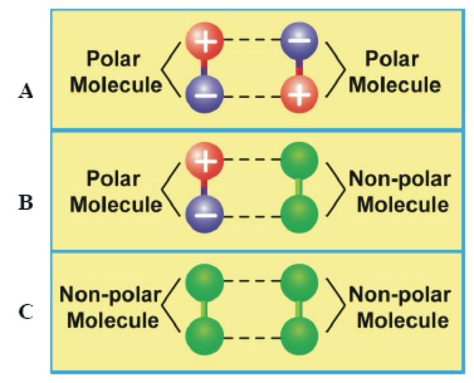

4. What makes you think that these attractions are weak?

\_\_\_\_\_\_\_\_\_\_\_\_\_\_\_\_\_\_\_\_\_\_\_\_\_\_\_\_\_\_\_\_\_\_\_\_\_\_\_\_\_\_\_\_\_\_\_\_\_\_\_\_\_\_\_\_\_\_\_\_\_\_

\_\_\_\_\_\_\_\_\_\_\_\_\_\_\_\_\_\_\_\_\_\_\_\_\_\_\_\_\_\_\_\_\_\_\_\_\_\_\_\_\_\_\_\_\_\_\_\_\_\_\_\_\_\_\_\_\_\_\_\_\_\_

5. Are these permanent or temporary attractions? How long do they last?

\_\_\_\_\_\_\_\_\_\_\_\_\_\_\_\_\_\_\_\_\_\_\_\_\_\_\_\_\_\_\_\_\_\_\_\_\_\_\_\_\_\_\_\_\_\_\_\_\_\_\_\_\_\_\_\_\_\_\_\_\_\_

\_\_\_\_\_\_\_\_\_\_\_\_\_\_\_\_\_\_\_\_\_\_\_\_\_\_\_\_\_\_\_\_\_\_\_\_\_\_\_\_\_\_\_\_\_\_\_\_\_\_\_\_\_\_\_\_\_\_\_\_\_\_

How do you think two non-polar (neutral) molecules attract since they have no charge? Let’s find out!

**Slide 7**

1.  What is the overall charge of each atom in this diagram? \_\_\_\_\_\_\_\_\_\_\_\_\_\_\_\_\_\_\_\_\_\_
2.  In the diagram, what side of the atom is more negative? \_\_\_\_\_\_\_\_\_\_\_\_\_\_\_\_\_\_\_\_\_\_\_
3.  Not including the nucleus, what side of the atom is less negative? \_\_\_\_\_\_\_\_\_\_\_\_
4.  Would the two atoms attract or repel? \_\_\_\_\_\_\_\_\_\_\_\_\_\_\_\_\_\_\_\_\_\_\_\_

Explain

\_\_\_\_\_\_\_\_\_\_\_\_\_\_\_\_\_\_\_\_\_\_\_\_\_\_\_\_\_\_\_\_\_\_\_\_\_\_\_\_\_\_\_\_\_\_\_\_\_\_\_\_\_\_\_\_\_\_\_\_\_\_

\_\_\_\_\_\_\_\_\_\_\_\_\_\_\_\_\_\_\_\_\_\_\_\_\_\_\_\_\_\_\_\_\_\_\_\_\_\_\_\_\_\_\_\_\_\_\_\_\_\_\_\_\_\_\_\_\_\_\_\_\_\_

\_\_\_\_\_\_\_\_\_\_\_\_\_\_\_\_\_\_\_\_\_\_\_\_\_\_\_\_\_\_\_\_\_\_\_\_\_\_\_\_\_\_\_\_\_\_\_\_\_\_\_\_\_\_\_\_\_\_\_\_\_\_

\_\_\_\_\_\_\_\_\_\_\_\_\_\_\_\_\_\_\_\_\_\_\_\_\_\_\_\_\_\_\_\_\_\_\_\_\_\_\_\_\_\_\_\_\_\_\_\_\_\_\_\_\_\_\_\_\_\_\_\_\_\_

**Slide 8**

1. What is the overall charge of each atom in this diagram?

\_\_\_\_\_\_\_\_\_\_\_\_\_\_\_\_\_\_\_\_\_\_\_\_\_\_\_\_\_\_\_\_\_\_\_\_\_\_\_\_\_\_\_\_\_\_\_\_\_\_\_\_\_\_\_\_\_\_\_\_\_\_

2. Would the two atoms attract or repel?

\_\_\_\_\_\_\_\_\_\_\_\_\_\_\_\_\_\_\_\_\_\_\_\_\_\_\_\_\_\_\_\_\_\_\_\_\_\_\_\_\_\_\_\_\_\_\_\_\_\_\_\_\_\_\_\_\_\_\_\_\_\_

Explain your answer

\_\_\_\_\_\_\_\_\_\_\_\_\_\_\_\_\_\_\_\_\_\_\_\_\_\_\_\_\_\_\_\_\_\_\_\_\_\_\_\_\_\_\_\_\_\_\_\_\_\_\_\_\_\_\_\_\_\_\_\_\_\_

\_\_\_\_\_\_\_\_\_\_\_\_\_\_\_\_\_\_\_\_\_\_\_\_\_\_\_\_\_\_\_\_\_\_\_\_\_\_\_\_\_\_\_\_\_\_\_\_\_\_\_\_\_\_\_\_\_\_\_\_\_\_

\_\_\_\_\_\_\_\_\_\_\_\_\_\_\_\_\_\_\_\_\_\_\_\_\_\_\_\_\_\_\_\_\_\_\_\_\_\_\_\_\_\_\_\_\_\_\_\_\_\_\_\_\_\_\_\_\_\_\_\_\_\_

**Slide 10**

1. Which molecule has the most contact with the green molecule?

\_\_\_\_\_\_\_\_\_\_\_\_\_\_\_\_\_\_\_\_\_\_\_\_\_\_\_\_\_\_\_\_\_\_\_\_\_\_\_\_\_\_\_\_\_\_\_\_\_\_\_\_\_\_\_\_\_\_\_\_\_\_

Explain your answer

\_\_\_\_\_\_\_\_\_\_\_\_\_\_\_\_\_\_\_\_\_\_\_\_\_\_\_\_\_\_\_\_\_\_\_\_\_\_\_\_\_\_\_\_\_\_\_\_\_\_\_\_\_\_\_\_\_\_\_\_\_\_

\_\_\_\_\_\_\_\_\_\_\_\_\_\_\_\_\_\_\_\_\_\_\_\_\_\_\_\_\_\_\_\_\_\_\_\_\_\_\_\_\_\_\_\_\_\_\_\_\_\_\_\_\_\_\_\_\_\_\_\_\_\_

\_\_\_\_\_\_\_\_\_\_\_\_\_\_\_\_\_\_\_\_\_\_\_\_\_\_\_\_\_\_\_\_\_\_\_\_\_\_\_\_\_\_\_\_\_\_\_\_\_\_\_\_\_\_\_\_\_\_\_\_\_\_

2. Explain how shape affects the number of attractions between the object and the surface.

\_\_\_\_\_\_\_\_\_\_\_\_\_\_\_\_\_\_\_\_\_\_\_\_\_\_\_\_\_\_\_\_\_\_\_\_\_\_\_\_\_\_\_\_\_\_\_\_\_\_\_\_\_\_\_\_\_\_\_\_\_\_

\_\_\_\_\_\_\_\_\_\_\_\_\_\_\_\_\_\_\_\_\_\_\_\_\_\_\_\_\_\_\_\_\_\_\_\_\_\_\_\_\_\_\_\_\_\_\_\_\_\_\_\_\_\_\_\_\_\_\_\_\_\_

\_\_\_\_\_\_\_\_\_\_\_\_\_\_\_\_\_\_\_\_\_\_\_\_\_\_\_\_\_\_\_\_\_\_\_\_\_\_\_\_\_\_\_\_\_\_\_\_\_\_\_\_\_\_\_\_\_\_\_\_\_\_

3. Which molecule acts most like the gecko seta?

\_\_\_\_\_\_\_\_\_\_\_\_\_\_\_\_\_\_\_\_\_\_\_\_\_\_\_\_\_\_\_\_\_\_\_\_\_\_\_\_\_\_\_\_\_\_\_\_\_\_\_\_\_\_\_\_\_\_\_\_\_\_

Explain your answer

\_\_\_\_\_\_\_\_\_\_\_\_\_\_\_\_\_\_\_\_\_\_\_\_\_\_\_\_\_\_\_\_\_\_\_\_\_\_\_\_\_\_\_\_\_\_\_\_\_\_\_\_\_\_\_\_\_\_\_\_\_\_

\_\_\_\_\_\_\_\_\_\_\_\_\_\_\_\_\_\_\_\_\_\_\_\_\_\_\_\_\_\_\_\_\_\_\_\_\_\_\_\_\_\_\_\_\_\_\_\_\_\_\_\_\_\_\_\_\_\_\_\_\_\_

\_\_\_\_\_\_\_\_\_\_\_\_\_\_\_\_\_\_\_\_\_\_\_\_\_\_\_\_\_\_\_\_\_\_\_\_\_\_\_\_\_\_\_\_\_\_\_\_\_\_\_\_\_\_\_\_\_\_\_\_\_\_

**Slide 11**

1. Describe the number and strength of forces involved in gecko adhesion.

\_\_\_\_\_\_\_\_\_\_\_\_\_\_\_\_\_\_\_\_\_\_\_\_\_\_\_\_\_\_\_\_\_\_\_\_\_\_\_\_\_\_\_\_\_\_\_\_\_\_\_\_\_\_\_\_\_\_\_\_\_\_

\_\_\_\_\_\_\_\_\_\_\_\_\_\_\_\_\_\_\_\_\_\_\_\_\_\_\_\_\_\_\_\_\_\_\_\_\_\_\_\_\_\_\_\_\_\_\_\_\_\_\_\_\_\_\_\_\_\_\_\_\_\_

\_\_\_\_\_\_\_\_\_\_\_\_\_\_\_\_\_\_\_\_\_\_\_\_\_\_\_\_\_\_\_\_\_\_\_\_\_\_\_\_\_\_\_\_\_\_\_\_\_\_\_\_\_\_\_\_\_\_\_\_\_\_

\_\_\_\_\_\_\_\_\_\_\_\_\_\_\_\_\_\_\_\_\_\_\_\_\_\_\_\_\_\_\_\_\_\_\_\_\_\_\_\_\_\_\_\_\_\_\_\_\_\_\_\_\_\_\_\_\_\_\_\_\_\_

2. What part of the atom moves in response to momentary charge rearrangements?

\_\_\_\_\_\_\_\_\_\_\_\_\_\_\_\_\_\_\_\_\_\_\_\_\_\_\_\_\_\_\_\_\_\_\_\_\_\_\_\_\_\_\_\_\_\_\_\_\_\_\_\_\_\_\_\_\_\_\_\_\_\_

\_\_\_\_\_\_\_\_\_\_\_\_\_\_\_\_\_\_\_\_\_\_\_\_\_\_\_\_\_\_\_\_\_\_\_\_\_\_\_\_\_\_\_\_\_\_\_\_\_\_\_\_\_\_\_\_\_\_\_\_\_\_

\_\_\_\_\_\_\_\_\_\_\_\_\_\_\_\_\_\_\_\_\_\_\_\_\_\_\_\_\_\_\_\_\_\_\_\_\_\_\_\_\_\_\_\_\_\_\_\_\_\_\_\_\_\_\_\_\_\_\_\_\_\_

\_\_\_\_\_\_\_\_\_\_\_\_\_\_\_\_\_\_\_\_\_\_\_\_\_\_\_\_\_\_\_\_\_\_\_\_\_\_\_\_\_\_\_\_\_\_\_\_\_\_\_\_\_\_\_\_\_\_\_\_\_\_

3. Describe this interaction between the electrons of each atom. Describe the overall charge and how long the attraction lasts.

\_\_\_\_\_\_\_\_\_\_\_\_\_\_\_\_\_\_\_\_\_\_\_\_\_\_\_\_\_\_\_\_\_\_\_\_\_\_\_\_\_\_\_\_\_\_\_\_\_\_\_\_\_\_\_\_\_\_\_\_\_\_

\_\_\_\_\_\_\_\_\_\_\_\_\_\_\_\_\_\_\_\_\_\_\_\_\_\_\_\_\_\_\_\_\_\_\_\_\_\_\_\_\_\_\_\_\_\_\_\_\_\_\_\_\_\_\_\_\_\_\_\_\_\_

\_\_\_\_\_\_\_\_\_\_\_\_\_\_\_\_\_\_\_\_\_\_\_\_\_\_\_\_\_\_\_\_\_\_\_\_\_\_\_\_\_\_\_\_\_\_\_\_\_\_\_\_\_\_\_\_\_\_\_\_\_\_

\_\_\_\_\_\_\_\_\_\_\_\_\_\_\_\_\_\_\_\_\_\_\_\_\_\_\_\_\_\_\_\_\_\_\_\_\_\_\_\_\_\_\_\_\_\_\_\_\_\_\_\_\_\_\_\_\_\_\_\_\_\_

4. Looking at the Adhesion Methods Debrief Chart from Lesson 5, which adhesive method matches most closely with what you have learned?

\_\_\_\_\_\_\_\_\_\_\_\_\_\_\_\_\_\_\_\_\_\_\_\_\_\_\_\_\_\_\_\_\_\_\_\_\_\_\_\_\_\_\_\_\_\_\_\_\_\_\_\_\_\_\_\_\_\_\_\_\_\_

\_\_\_\_\_\_\_\_\_\_\_\_\_\_\_\_\_\_\_\_\_\_\_\_\_\_\_\_\_\_\_\_\_\_\_\_\_\_\_\_\_\_\_\_\_\_\_\_\_\_\_\_\_\_\_\_\_\_\_\_\_\_

\_\_\_\_\_\_\_\_\_\_\_\_\_\_\_\_\_\_\_\_\_\_\_\_\_\_\_\_\_\_\_\_\_\_\_\_\_\_\_\_\_\_\_\_\_\_\_\_\_\_\_\_\_\_\_\_\_\_\_\_\_\_

\_\_\_\_\_\_\_\_\_\_\_\_\_\_\_\_\_\_\_\_\_\_\_\_\_\_\_\_\_\_\_\_\_\_\_\_\_\_\_\_\_\_\_\_\_\_\_\_\_\_\_\_\_\_\_\_\_\_\_\_\_\_

**Essay Assessment: Demonstrate Your Understanding**

Write a short essay in response to the prompt below. Base your essay on what you have learned about gecko adhesion throughout the module. You may refer to your journal to help you plan your response; however, the writing in the essay should be distinct from your journal and be written in your own words (i.e., no copying). Your response to the prompt should not exceed one page. You may use diagrams to illustrate concepts; however, the diagrams should reinforce your written explanations not replace them.

**Writing Prompt**

Explain how the gecko can adhere to a ceiling. Your written explanation should include the following:

* Describe (with words and/or drawings) the surface-to-surface interactions between gecko “setae” and a ceiling. Be sure to address the characteristics of both the setae and the surface. Include the shape, number, and size of setae in contact with the surface.
* Describe the variables affecting adhesion: the surface area, the surface contact, and the type of surface.
* Explain how a lot of tiny adhesive forces overcome the force of gravity.
* Describe the electrical forces and their role in gecko adhesion (i.e., interactions of charged particles between atoms of the spatula and the ceiling surface).

Refer to the instructional rubric on the next page to learn of the criteria that will be used to evaluate your writing.

<table id="x-ck12-dGFibGU6" title="" summary=""><caption>Instructional Rubric for Essay Assessment</caption><thead><tr><th>Criteria</th><th>Advanced (4)</th><th>Proficient (3)</th><th>'Partially Proficient (2)</th><th>Novice (1)</th></tr></thead><tbody><tr><td><strong>Writing Style and Mechanics</strong></td><td><strong>Concise, clear, and engaging explanations</strong> with <strong>flawless</strong> spelling, punctuation, and grammar.</td><td><strong>Concise and clear</strong> explanations with <strong>minor errors</strong> that do not interfere with communication.</td><td><strong>Appropriate writing</strong> format. Writer does <strong>not appear to have carefully proofread.</strong></td><td><strong>Demonstrates little or no attention</strong> to the writing format. Has great difficulty communicating.</td></tr><tr><td><strong>Understanding of Content</strong></td><td><ul id="x-ck12-ZTcxMjQ4YjBlY2IxZWRjNGY5NTI2ZTFjMTc2MGUwNDg.-cqa"><li><strong>Explanations</strong> are complete* and <strong>detailed, demonstrating a sophisticated</strong> understanding of surface-to-surface interactions and forces affecting adhesion.</li><li>Writes in <strong>own words</strong> using <strong>common &amp; scientific language.</strong></li></ul>
<nobr>∗</nobr>Responses include answers to all four bullet points in the prompt.
</td><td><ul id="x-ck12-NTU2MDdiMGNhYTc4MjY0NGJmZjEyMjJmYWM0MGRkZGQ.-cgv"><li><strong>Explanations</strong> are <strong>complete</strong>* demonstrating an understanding of surface-to-surface interactions and forces affecting adhesion.</li><li><strong>No clear inaccuracies</strong> or misconceptions.</li><li>Mostly writes in <strong>own words</strong> using <strong>common &amp; scientific language.</strong></li></ul>
<nobr>∗</nobr> Responses include answers to all four bullet points in the prompt.
</td><td><ul id="x-ck12-YWM0MmI5ZjlhMGQxODI3MjA2YTcyYzNlMDhkODFmNTc.-64a"><li><strong>Explanations demonstrate a basic</strong> understanding of surface-to-surface interactions and forces affecting adhesion.</li><li><strong>May contain inaccurate</strong> or <strong>incomplete</strong> information.</li><li>Writes using <strong>scientific language</strong> only, <strong>not always writing in own words.</strong></li></ul></td><td><ul id="x-ck12-MGUwZGI5MWQ4YzNhNzU4NmVjMmE3MzI1N2ZkYzIzYWQ.-vkc"><li>Explanations are <strong>missing important information.</strong></li><li><strong>Does not demonstrate a basic understanding</strong> of surface interactions and forces affecting adhesion and/or <strong>contains inaccuracies.</strong></li><li>Writing is <strong>not in own words.</strong></li></ul></td></tr></tbody></table>

_Investigating Static Forces in Nature: The Mystery of the Gecko_

Lesson 8: How Can a Gecko Walk on a Ceiling?

Student Journal

© 2009 McREL

</article>

